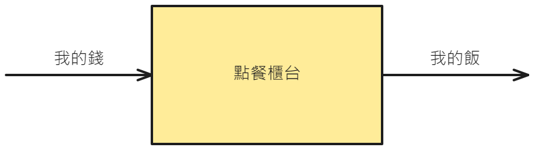
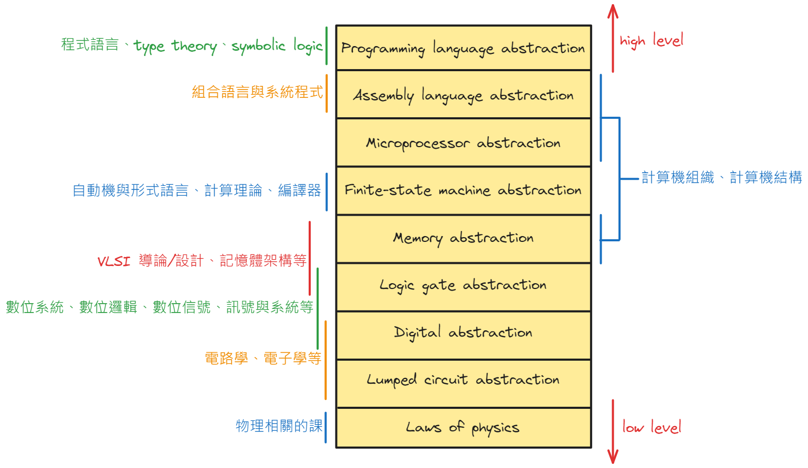
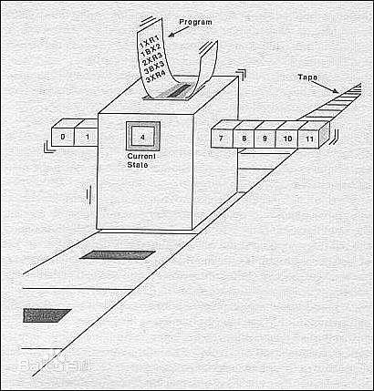
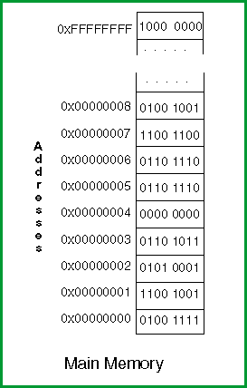
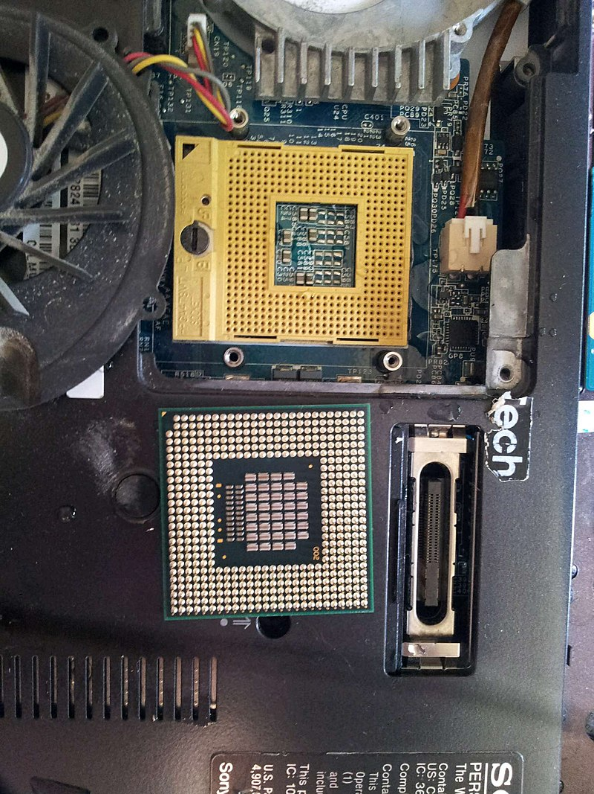
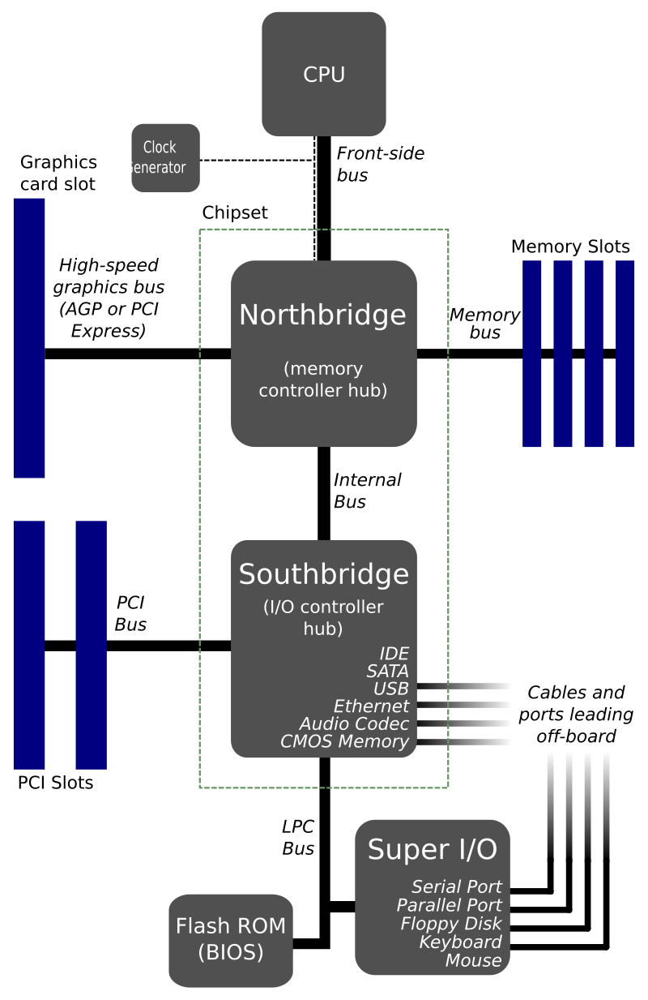
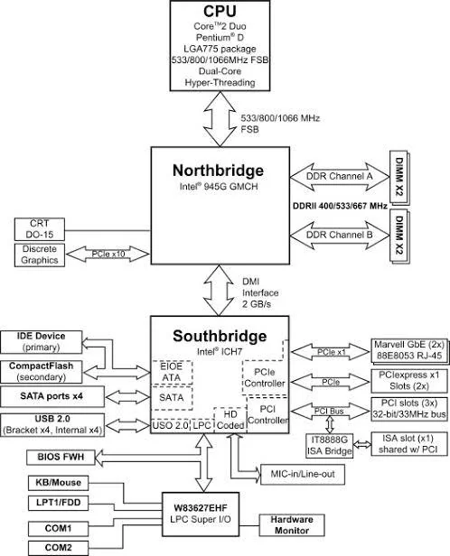
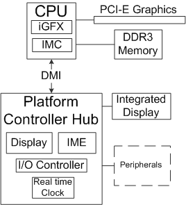
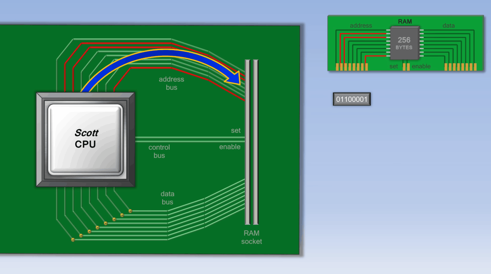
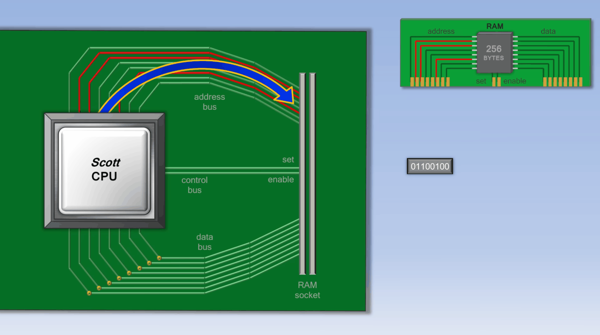



# 前言

在閆令琪老師的 GAMES202 的第一堂課中，老師有一段話我覺得講得蠻好的：

> 我們在學 202(課名) 的過程中一定要記得這件事情，科學與技術是不等同的，當然這件事情是我個人的理解，我認為科學和技術是嚴格意義上不等同的兩樣事情。 科學代表著知識，代表你對於這個世界應當如何去運作的理解；然後技術是什麼呢? 技術更多代表的是技巧，就是所謂的 engineering skills，工程能力啊。 然後技術是用來幹什麼的呢? 是要把科學轉換為產品的這麼個意思
>
> 而科學和技術通常人們會簡稱科技，這是為什麼呢? 這是因為絕大多數人認為這兩件事情，反正我都不懂，所以像是一回事對吧，但對於我們來說，要區分一下 science 和 technology。 
>
> 一個最典型的例子就是「車」對吧，大家知道汽車這個東西，大家在很久之前，就已經知道應該怎麼樣去運作了，但是直到今天，咱們國產的車子性能仍然不是特別那個對吧(XD)，所以說啊，這就是「技術」在背後起到的關鍵作用
>
> 所以說科學和技術不等同，但我沒有說哪一項更重要，技術和科學我可以認為他們同等重要

對於工程的問題，我們通常會有 spec 來嚴格定義我們所想要的行為，遇到什麼狀況需要做什麼事。 而我個人感覺學校在教「科學」類型的課程時，通常不會講得這麼嚴謹，因為這類的系統比較開放，你很難像工程的問題那樣對所有的事都做嚴格定義

換句話說就是比較模糊，而這類問題通常數學就會多，也因此我個人覺得「數學」其實是門很模糊的語言，用 CS 的角度去看很多東西的定義都有點模糊，也因此想要用數學把想法描述清楚是一件相對困難的事情，數學系還會花特別一學期來教你怎麼做這件事，通常是基礎數學或是數學導論之類的大一必修課

當然這個是我個人的理解，數學比我好的人多的是，也許他們又會有不同的想法。 但至少與朋友閒聊時我發現有些蠻厲害的工程師也跟我有同樣的觀點，所以我想這至少不是只有我一個人的想法，蠻有趣的

對於語言這個東西，以我的經驗來說，資工系大部分的課就是教 C/C++ 或 python，而教法不外乎就是開始從變數、型態、函式、class 這樣一路講一下概念，帶幾個例子後出個作業就過去了

換句話說，我覺得這些課的教法很接近於「科學」類型的課程的教法，講講概念，讓你看幾個例子有個經驗，出幾個作業讓你熟悉一下這個「感覺」。

然而語言是一個工程類的東西，它是有 spec 的，裡面嚴格定義了什麼樣的輸入該有什麼樣的輸出，因此學習語言的過程你應該要去讀 spec，而不是依靠「經驗」，它不是一個開放的系統，它是一個人定義出來的封閉系統。

換句話說學語言跟學下棋是很類似的，例如西洋棋，在學的時候你需要先理解棋子移動的規則，而且你需要去遵守這些規則，所以你會去看西洋棋的規則書/說明書(spec)，而不是找個人來告訴你棋子移動的「經驗」法則。 

同樣地，你需要去遵守語言 spec 裡面的規則，而不是自己去嘗試跑一次你的 code，發現會動後就認為那樣的寫法是對的，甚至是認為不需要遵守 spec 內的規則，會動與正確是兩件事情，在工程上我們會利用 UB、IB 等規則來對這種錯誤的寫法去做規範，之後有機會的話會再講到。

另外，要如何利用這些規則來贏遊戲，也就是所謂的戰術，就需要依賴經驗了，這在語言的部分也是一樣的，要怎麼寫出好的程式碼也需要經驗，可能會有一些前人發現的法則、規律，但它們是可調整的，就像下棋一樣，你可以自己去研發自己的套路。

總而言之，寫語言記得翻 spec，遵守 spec，語言是被嚴格定義好地，你不該利用經驗法則去判斷一個寫法是否正確

要注意我並不是指「科學」較淺，「技術」較深，而是指這兩種東西的面向不同，學習方法也理當有差，不該混用

這個礦坑系列的教學會時不時地引用 spec 內的定義，來教新手 C\+\+，由於 C\+\+ 相對其他語言來說較為底層，也就是說比較接近硬體，抽象化的程度比較少，因此在進入 C\+\+ 的教學之前，我覺得最好先寫一篇對電腦運作的簡述，帶大家簡單學習一下計算機概論

# 如何學習一樣東西

我覺得學一樣東西最快的方法就是寫部落格，只要將自己的理解輸出出來，你就知道自己大概哪裡卡了，哪裡不懂。 為了寫文章，熟悉一些工具肯定是沒有壞處的，具體可以參考這篇：

- [GNU/Linux 開發工具共筆](https://hackmd.io/@sysprog/gnu-linux-dev/https%3A%2F%2Fhackmd.io%2F%40sysprog%2Fr1Psrf0KW)

而 blog 的內容不外乎就是記錄自己的思緒，你應該嘗試將你的主題整理出一個脈絡，照著這個脈絡，盡可能簡單地，一步一步的完成你的文章

> If you can’t explain something in simple terms, you don’t understand it ー Richard Feynman

在學習的過程中你肯定會遇到問題，這種時候你應該先嘗試釐清你的問題，將問題化為需求，然後列出完成需求的步驟，如此一來就可以很清晰的一步一步解決你的問題

舉個例子，老師今天發了個 OpenGL 的作業下來，要你們裝一台 Ubuntu 的虛擬機來執行 sample code，但你從來「沒聽過」什麼是虛擬機，那這時候就需要先釐清你的問題，再整理成需求，脈絡可能如下：

1. 什麼是虛擬機?
2. 我的電腦是 windows 的系統，我要怎麼在 windows 上裝 Ubuntu 的虛擬機?
3. google 後發現有許多個虛擬機可以裝，像是 VMware、VirtualBox、WSL 等，裝哪個好?
4. 假設我想裝 WSL，那 WSL 要怎麼裝?
5. WSL 裝好後，要怎麼灌 Ubuntu?
6. Ubuntu 灌好後，要怎麼裝 OpenGL? 我要如何知道我的 OpenGL 裝成功了?
7. 我要怎麼編譯和執行 OpenGL 的程式嗎?

這時你就成功把你的問題化成了 7 個「需求」，或者說比較直接的問題，這種問題你一 google 下去，十之八九可以直接 google 到答案，不需要再在一堆搜尋結果中找半天

換句話說，「需求」很接近你完成問題的「步驟」

然而在遇到問題時，你肯定無法很直接的像這樣將大部分的需求全部列出來，這種情況你可以先嘗試照著順序將已知的需求完成，通常新的需求就會冒出來了

當你無法列出需求時，這通常代表你的背景知識不足，導致你建立不了步驟與步驟之間的連結；抑或是這個東西非常的冷門，此時你就該找人詢問了，有關提問的方法請參考非常有名的一篇文章：

- [提問的智慧](https://github.com/ryanhanwu/How-To-Ask-Questions-The-Smart-Way)

而各位生在 2024 年這個 LLM 如此發達的時代，肯定會想要利用它來學習，LLM 能夠很快的幫你分析出你的需求，但我個人不建議新手直接使用 LLM，原因不外乎有二

1. 新手非常需要練習這種「釐清問題」的能力，在你的生涯中，你遇到的問題會越來越大，當需求越來越多時，你再使用 LLM 這樣幫你跳過分析的過程，那你高機率會陷入擁有需求卻無法解決的狀況
2. 你在分析問題過程中，或多或少都會摸到一些額外的知識，像是你小時候在 wiki 裡面逛一個一個的標籤一樣，這些機會會是你增加知識廣度的一個很大來源

LLM 十分方便沒錯，是個很好的工具，能幫助你節省時間，但如果你從一開始就在節省時間，那在建構你自己的思考模型時就很容易會有缺漏，就好像吃飯吃太快會消化不良一樣，知識也會消化不良

如果是狀況緊急，需要速成的情況則另當別論，直接用 LLM 跳過思考的過程是個不錯的方法，能夠幫助你很快的解決需求，但在這種知識這麼集中的環境下學習，就如同機器學習會 overfitting 一樣，很容易讓你將局部的知識當作普遍定理，導致誤解，切要注意這點

以上都為個人經驗與理解，由於發現初學者會有連 google 都不知道怎麼搜，遇到問題呆住的情況，因此在這邊多弄一個小節來教大家怎麼 google

接下來就開始進到計概的內容~~

# 抽象化 Abstraction

## 抽象化是什麼

工程的目的是使用科學，科學提供了對自然現象的理解，而抽象則是對現象做包裝的一種方法，例如生活中的「顏色」，顏色是人的感官對於特定波長的電磁波的解釋，但當我們平常聊天在講「紅色」時不會特別地去強調「620-750nm 的電磁波」的這個資訊，更多是在強調人的感官的解釋。

換句話說，「紅色」這個詞是對「620-750nm 的電磁波」所做的抽象化，它對「620-750nm 的電磁波」做了包裝。 在用「紅色」這個詞的時候，我們把「620-750nm 的電磁波」、人眼的構造與大腦對人眼訊號的解析等等地細節都隱含的省略掉了，因為我們只在意 620-750nm 的電磁波對我們造成的感官結果。這讓我們在對話的過程中可以很簡單的達到共識，抓到重點。 

所以，用一句話來描述抽象化的概念就是「不管中間細節，只在乎輸入與輸出的關係」，我們不在意中間過程的細節，想把它全部忽略掉，更多的時候我們會說把它當成一個黑箱，我們只想知道丟了一個東西進去，會有什麼樣的結果出來

再舉個我很喜歡的例子，假設我們要去餐廳點餐，那我們在意的重點是「我要付多少錢才可以拿到我想要的餐點」，我們不在乎餐廳的人員要如何跟廚房溝通、廚師有幾人、用的調味料產自何處和他們要如何製作這份餐點，只要我付完錢，我要的餐點會來，這樣就可以了

畫成圖來說就是這樣：

我不在乎中間那個框框(黑箱)內做了什麼，我只在乎我的錢進去框框後，我的飯會從框框內出來

## 電路科學的抽象化

學電機的人會利用 Maxwell's equations 來研究電磁現象，然後在 Maxwell's equations 之上創建一個新的抽象層，稱為集總電路(lumped circuit abstraction)，利用集總電路我們可以再增加一個新的抽象層，稱為數位層(Digital abstraction)，而利用數位電路又可以再增加一層邏輯閘層(Logic gate abstraction)

以此類推，可以分好多好多層下去，這些不同的抽象層面就對應到電腦科學中不同的專業領域：

這邊的分類是我照著我電子電路學課本「foundation of analog & digital electronic circuits by anant agarwal」內的分類畫出來的，課本的分類我覺得合理。 這中間的每一層都可以再各自有其細分下去的抽象層，而 Programming language 的上方就是各式各樣的程式了。 

然後我大概把資工、電機系內對應的課大概寫了一下，只寫了我有摸過、聽說過的，有些理解的不深，如果有錯麻煩再糾正我一下XD

# 圖靈機 Turing machine

圖靈機是一個在自動機理論與計算理論中定義的數學模型，因為是計概所以我這邊不寫它的數學定義，有興趣的可以看一下自動機理論這門課

我覺得 wiki 上的描述寫得很好，所以讓我們看一下 [wiki](https://zh.wikipedia.org/wiki/%E5%9B%BE%E7%81%B5%E6%9C%BA) 上的描述：

圖靈機基本思想是用機器來模擬人類用紙筆進行數學運算的過程，它把這個過程看作下列兩種簡單的動作：

- 在紙上寫上或擦除某個「符號」
- 把注意力從紙的一處移動到另一處

而在每個階段，人要決定下一步的動作依賴於兩個條件：

- 此人當前所關注位置上的符號
- 此人當前思維的狀態

為了模擬這個過程，圖靈構造出一台假想的機器，該機器由以下幾個部分組成：

1. 一條無限長的紙帶(TAPE)，其被分為一個接一個的小格子，每個格子上包含一個來自有限字母表的符號，字母表中需要一個特殊的符號代表空白。 紙帶上的格子由左至右依次編號為 0, 1, 2, ...，無限伸展下去   
    :::info   
    :bulb: 這裡的有限字母表基本上就是一個有限集合，元素是定義的符號   
    :::   
2. 一個讀寫頭(HEAD)。 它可以在紙帶上左右移動，讀出當前所指的格子上的符號，並且能改變它
3. 一個狀態暫存器。 它用來儲存圖靈機當前所處的狀態。 圖靈機的所有可能狀態的數目是有限的，並且有一個特殊的狀態，稱為停機狀態，在這邊不是我們的重點，可以先不理他
4. 一套控制規則數量有限的表格(TABLE)。 它根據當前機器所處的狀態以及當前讀寫頭所指的格子上的符號來決定讀寫頭下一步的動作，並改變狀態暫存器的值，讓機器進入一個新的狀態。 
    
    其會按照以下順序告知圖靈機命令：
    1. 寫入(替換) 或擦除當前符號
    2. 移動讀寫頭，有三種移動方法：「L」表示向左，「R」表示向右，「N」表示不移動。 每次最多移動一格。
    3. 保持當前狀態或者轉到另一狀態。

注意這個機器的每一部分都是有限的，但它有一個潛在的無限長的紙帶，因此這種機器只是一個理想的裝置。 圖靈認為這樣的一台機器就能類比人類所能進行的任何計算過程

 

另外這篇也寫得很好，也更詳細，建議可以讀一下：[搞懂「通用圖靈機」的終站——它的誕生與意義](https://pansci.asia/archives/203152)

而在現代，我們所謂的「電腦」，或正式一點稱它為「計算機」，其實就是圖靈機的一種實作方法，現在較主流的實作方法是使用馮諾伊曼架構，比較大的特色是將儲存裝置與中央處理器分開了。 

以比較常見的家用 PC 來說，對應的關係大概如下：

| 圖靈機組件 | 對應電腦元件 | 功能 |
| --------- | ------------ | -------- |
| 紙帶（Tape） | 主記憶體（RAM）或儲存裝置，像是 Disk | 提供資料和指令的存儲空間 |
| 讀寫頭（Head） | 記憶體控制器、匯流排 | 負責控制 CPU 與記憶體之間的資料傳輸 |
| 狀態暫存器（State Register） | CPU 中的暫存器（如程序計數器、狀態暫存器） | 保存當前的執行狀態和指令位置，控制程序的執行流程 |
| 規則表格（Transition Function/Table） | CPU 的控制單元和指令集架構 | 根據當前狀態和指令來解碼和執行操作，控制資料流和指令執行 |

另外還有一些其他的實作方法，但目前就較偏向用在特殊場合的設計，所以我們這裡就不特別展開敘述了。

由於現代的電腦只是種圖靈機的實作，因此在定義語言的時候，我們會針對圖靈機去定義，而不是針對電腦去定義，因為沒有人可以確定之後不會出現新的實作方法，在 spec 中可以看見這段話：

> [n4861(4.1.1-1)](https://timsong-cpp.github.io/cppwp/n4861/intro.abstract#1):
> The semantic descriptions in this document define a parameterized nondeterministic abstract machine. This document places no requirement on the structure of conforming implementations. In particular, they need not copy or emulate the structure of the abstract machine. Rather, conforming implementations are required to emulate (only) the observable behavior of the abstract machine as explained below.

這邊 spec 用的詞是「abstract machine」，在這邊可以先簡單理解為差不多的東西

# CPU & RAM & Bus

## CPU & RAM & Bus

從圖靈機我們可以看出，其實只要有 CPU、RAM、Bus，就差不多可以完成一台計算機了，現在我們就來針對這三個硬體來做介紹，幫助大家更理解計算機的運作。 這邊有一部很好的影片，大家也可以看看：[How a CPU Works](https://www.youtube.com/watch?v=cNN_tTXABUA)

RAM 主要有兩種：靜態 RAM 與動態 RAM，又分別被稱為 SRAM 與 DRAM； SRAM 相對來說速度比較快，但成本比較高，在電腦科學中到處都有這類的 trade-off，所以要如何做取捨就是門學問了

而前面有提到 memory 對應到圖靈機中的紙帶的部分，因此它負責提供資料和指令的存儲空間，我們可以將紙袋上的每一個格子視為一個 bit，並且我們會給記憶體標上位址：

1. 可以存資料和指令，紙帶一格對應到一個 bit
3. 位址通常以 Byte 為單位，也就是 8 個 bit

假設是 4G 的 memory，那它的記憶體位址就可以從 0 一路寫到 4 \* 1024 \* 1024 \* 1024，換句話說就是從 0 到 4,294,967,295。 我們通常喜歡用 16 進位表示，所以會寫成 0 ~ 0xFFFFFFFF：

(source: [Integer Arithmetic and Memory Access](https://www.eecis.udel.edu/~davis/cpeg222/AssemblyTutorial/Chapter-04/ass04_5.html))

當 CPU 想要讀寫 memory 時，需要傳一個訊號給記憶體控制器，這東西裡面包含了讀寫 DRAM 所需的邏輯。 因此你可以看到 CPU 上有很多針腳，它們會接到 Bus 上，讓 CPU 能夠透過 Bus 收發資料：

 
(source：[wiki](https://en.wikipedia.org/wiki/Central_processing_unit#/media/File:Laptop-intel-core2duo-t5500.jpg))

以前會把記憶體控制器做在北橋裡面，北橋再拉 Bus 到 memory 上，因此 CPU 想要跟 memory 溝通，就需要先到北橋，再到 memory 去。 其中 CPU 到北橋的這段 Bus 有個名字被稱為 Front-side bus(FSB)，而記憶體控制器到 memory 的這段 Bus 叫 memory bus：

(Pentium II/III 時代的典型晶片組佈局) 
(source：[wiki](https://en.wikipedia.org/wiki/Front-side_bus#/media/File:Motherboard_diagram.svg))

(我覺得這張寫得更清楚一點) 
(source：[Anyone know what this part of my motherboard is?](https://www.reddit.com/media?url=https%3A%2F%2Fpreview.redd.it%2Fanyone-know-what-this-part-of-my-motherboard-is-v0-794wyr5ninvc1.jpeg%3Fwidth%3D498%26format%3Dpjpg%26auto%3Dwebp%26s%3D7dab33952489ae88d70d9369411c91e93845a972))

途中可以看到北橋還會接一些較高速的周邊裝置，通常使用的是 AGP 或是 PCIe 協定。 後來，CPU 持續的在變快，導致 FSB 的頻寬跟不上上了，這個瓶頸導致大概在 2008 年時 FSB 就被淘汰了

之後的設計慢慢改成了點對點和 serial 對接，將記憶體控制器與較高速的 AGP/PCIe 通道這兩個東西直接併入到了 CPU 晶片中，讓裝置直接與 CPU 對街，並將北橋剩下其他剩下的小功能併入了南橋中，從而將傳統的北橋給消除掉了

在接顯卡時大家都會說顯卡接在直連 CPU 的通道，也是因為以前北橋上的高速 PCIe 通道被併進去了，所以才會說是「直連 CPU 的通道」。 而圖中的另一個 bridge 為南橋，負責處理與其他速度較低的外設的溝通，像是 EIOE ATA、SATA、USB、ISA slot、PCI/PCIe slot 或是 BIOS 的溝通等等

在 Intel 的術語中，其以 memory controller hub(MCH) 稱呼北橋，以 I/O controller hub(ICH) 稱呼南橋，在將北橋的剩餘功能移到南橋內之後，其將 ICH 改名為了 Platform Controller Hub(PCH)；而在 AMD 的架構中，與 PCH 對應的晶片組被稱為 FCH

 
(source：[wiki](https://en.wikipedia.org/wiki/Platform_Controller_Hub#/media/File:Intel_5_Series_architecture.png))

除了南橋的所有功能之外，PCH 還合併了一些剩餘的北橋功能（例如 clock）。系統時脈以前是與專用晶片連接的，但現在被合到了 PCH 裡面。 PCH 和 CPU 之間有兩種不同的連接：Flexible Display Interface(FDI)和 Direct Media Interface(DMI)，不過這我也不熟，就不展開了

題外話，PCH 中的有顆東西叫 IME，其全名為 Intel Management Engine，原本在北橋內，從 Nehalem 處理器和 Intel 5-Series 系列晶片組開始改成內置在 PCH 中了。 它是一個獨立的子系統，擁有自己的 MAC 和 IP 位址，而且能夠在系統啟動前、OS 運行期間甚至是關機的情況下運行，用來為搭載 Intel 處理器的電腦系統提供各種功能與服務

很諷刺的是之前有駭客扁進了 Intel Management Engine 然後把所有資訊倒了出來，有興趣的可以看一下：[36C3 - Intel Management Engine deep dive](https://www.youtube.com/watch?v=3CQUNd3oKBM)。

Bus 負責傳輸資料，其主要分成三種：Data bus、Address Bus、Control Bus

- Address Bus   
  Address Bus 用來指定 physical address，當 CPU 或支援 DMA 的裝置需要讀取或寫入某個記憶體位址時，就會透過 Address Bus 來指定該記憶體位址。 Address Bus 的寬度決定了系統可以尋址的記憶體量，例如 32-bit 的 Address Bus 就可以尋址 $2^{32}$(4,294,967,295) 個位址
- Data Bus  
  Data Bus 用來傳送實際的資料，通常是雙向的
- Control Bus   
  Control Bus 用來傳輸控制信號，像是讀/寫命令，clock 信號等等

當 CPU 欲與 memory 溝通時，會先將欲操作的位址在 Address Bus 上設成高電位，再利用 Control Bus 將 control bit 依照 spec 設好，最後透過 Data Bus 讀寫資料：

[How a CPU Works](https://www.youtube.com/watch?v=cNN_tTXABUA) 這部影片裏面引用了一個簡單的 CPU 模型，稱為 Scott's CPU，其 Address Bus 和 Data Bus 各有 8 個 bit，Control Bus 則有 set 與 enable 這兩個 bit，對於讀取來說就會長這樣：

 

先在 Address Bus 上將要操作的 address 設為高位，接著將 Control Bus 上的 enable 設為高位，最後將資料讀進來。

寫入則長這樣：

 

順序稍微不一樣，先將 Address Bus 設好，然後將 data 送上 Data Bus，最後將 Control Bus 的 set 設為高位

## CPU cache

我個人覺得這部分不是我們計概(了解電腦運作的 map )的重點，所以就先不寫了，未來如果有機會可能會再補上

不過 jserv 老師有翻譯一篇很好的論文，雖然難度比較高，但有興趣的可以去讀看看：[每位程式開發者都該有的記憶體知識](https://sysprog21.github.io/cpumemory-zhtw/introduction.html)

# BIOS & OS

## BIOS

### EEPROM

## OS

### 系統呼叫 System call

# ELF & PE File

## 二進位檔案 Binary File

## 可執行檔 Executable File

## 副檔名 Filename Extension

# Reference

- [(wiki) Bus](https://en.wikipedia.org/wiki/Bus_(computing))
- [(wiki) System Bus](https://en.wikipedia.org/wiki/System_bus)
- [(wiki) Control bus](https://en.wikipedia.org/wiki/Control_bus)
- [(wiki) Memory Controller](https://en.wikipedia.org/wiki/Memory_controller)
- [(wiki) Front-side bus](https://en.wikipedia.org/wiki/Front-side_bus)
- [(wiki) Channel I/O](https://en.wikipedia.org/wiki/Channel_I/O)
- [(wiki) Dynamic random-access memory](https://en.wikipedia.org/wiki/Dynamic_random-access_memory)
- [(wiki) PCI Express](https://en.wikipedia.org/wiki/PCI_Express)
- [(wiki) Central processing unit](https://en.wikipedia.org/wiki/Central_processing_unit)
- [(wiki) Memory management unit](https://en.wikipedia.org/wiki/Memory_management_unit)
- [(wiki) DDR2 SDRAM](https://en.wikipedia.org/wiki/DDR2_SDRAM)
- [(wiki) DDR3 SDRAM](https://en.wikipedia.org/wiki/DDR3_SDRAM)
- [(wiki) DDR4 SDRAM](https://en.wikipedia.org/wiki/DDR4_SDRAM)
- [(wiki) DDR Interface Protocol DDR](https://electronics.stackexchange.com/questions/465749/ddr-interface-protocol)
- [(wiki) Northbridge (computing)](https://en.wikipedia.org/wiki/Northbridge_(computing))
- [(wiki) Southbridge (computing)](https://en.wikipedia.org/wiki/Southbridge_(computing))
- [How does cpu communicate with peripherals?](https://stackoverflow.com/questions/6852332/how-does-cpu-communicate-with-peripherals)
- [Cisco Data Center Virtualization Server Architectures](https://www.ciscopress.com/articles/article.asp?p=1606902&seqNum=2)
- [(wiki) Platform Controller Hub](https://en.wikipedia.org/wiki/Platform_Controller_Hub)
- [(wiki) AMD Fusion Controller Hub](https://zh.wikipedia.org/zh-tw/AMD_Fusion_Controller_Hub)
- [(wiki) Flexible Display Interface](https://en.wikipedia.org/wiki/Flexible_Display_Interface)
- [(wiki) Direct Mdeia Interface](https://en.wikipedia.org/wiki/Direct_Media_Interface)
- [Anyone know what this part of my motherboard is?](https://www.reddit.com/r/pcmasterrace/comments/1c77mbm/anyone_know_what_this_part_of_my_motherboard_is/)
- [Basic Knowledge of Industrial Computers (CPU/Chipset)](https://www.contec.com/support/basic-knowledge/edge-computing/cpu/)
- [Motherboard](https://www.sciencedirect.com/topics/engineering/motherboard)