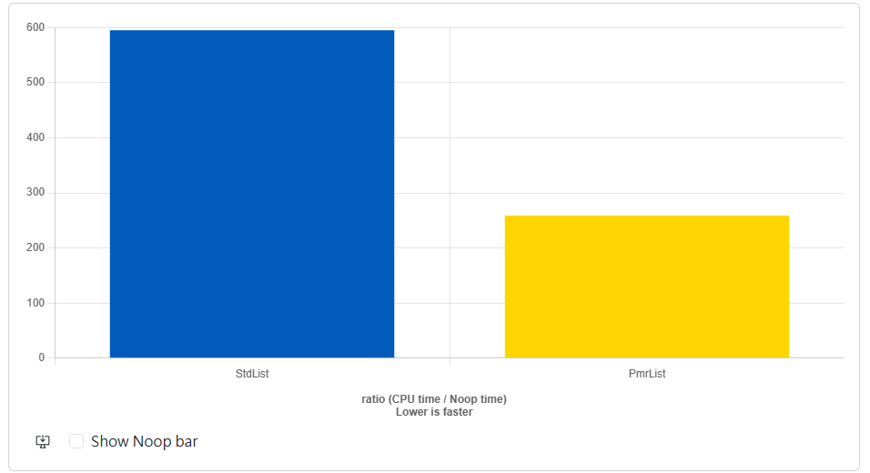
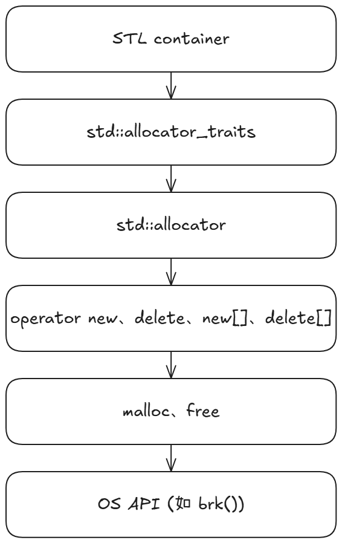
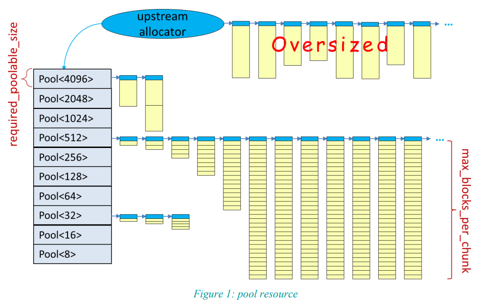

# 礦坑系列 ── Allocator & PMR

礦坑系列首頁：<strong><a href = "https://github.com/Mes0903/Cpp-Miner/tree/hackmd" class = "redlink">首頁</a></strong>

hackmd 版首頁：<strong><a href = "https://hackmd.io/@Mes/Cpp_Miner/https%3A%2F%2Fhackmd.io%2F%40Mes%2FPreface" class = "redlink">首頁</a></strong>

## 前言

原本會有這篇是因為 MISRA C/C++ spec 內規定不能用 heap allocation，朋朋剛好遇到了這個需求，所以來問了一下能不能把 data 全部放在 stack 段上的 memory pool，剛好要讀書會了，就拿這個主題來寫一篇

Allocator 與 PMR 讓你能在 stack 上開一個 memory pool，利用 STL 給的 API 去操控它，STL 的容器也可以將 data 配置於其中，不必再使用到 heap，進而避免 heap allocation，帶來一些加速的效果，尤其是對樹狀結構的 heap allocation 而言，在 free memory 時其也會有一定的負擔，對於這種結構的加速會更好

這篇文會參考 Jason Turner 的影片（應該很多人看過?），還有 C++17 Complete Guide 裡面的章節，順便再整理一下幾場 CppCon 與 [N3916](https://www.open-std.org/jtc1/sc22/wg21/docs/papers/2014/n3916.pdf) 的內容

底下是一個 Jason Turner 在影片底下給的 `std::list` 的例子（[Quick C++ Benchmark 連結](https://www.youtube.com/redirect?event=video_description&redir_token=QUFFLUhqbkVWWEppM3NqTl9pWmRQQXJIcHpUMDNxcFlSUXxBQ3Jtc0ttX1d5TGRXSEluTU1PWWZlcHhCLUNwUE9LdUlYVml5ODNvNGZRdUVYX1R0N1kwYnpTYjBnT1k1bzlQeU05c1pBQ3kzb0ZVckdFLVAtdHlEcUtCM1RjeVNiOU5EX0RQYkFDb2E1OENKeTdpTlN4UE5qTQ&q=https%3A%2F%2Fquick-bench.com%2Fq%2FgyRE6p5EdZ-2P0XOAUwO99JRN7g&v=q6A7cKFXjY0)）：

```cpp
#include <memory_resource>
#include <list>

void StdList(benchmark::State& state) {
  for (auto _ : state) {
    std::list<int> list{1, 2, 3, 4, 5, 6, 7, 8, 9, 10};
    benchmark::DoNotOptimize(list);
  }
}
// Register the function as a benchmark
BENCHMARK(StdList);

void PmrList(benchmark::State& state) {
  std::array<std::byte, 1024> buffer;
  for (auto _ : state) {
    std::pmr::monotonic_buffer_resource mem_resource(buffer.data(), buffer.size());
    std::pmr::list<int> list({1, 2, 3, 4 , 5, 6, 7, 8, 9, 10}, &mem_resource);
    benchmark::DoNotOptimize(list);
  }
}
// Register the function as a benchmark
BENCHMARK(PmrList);
```

輸出結果：



你可以看到，由於不需要 heap allocation，因此效能提升了許多。 那我們就先講如何使用，後面再來談談一些標準內的內容

## Allocator 與 `std::allocator`

### 歷史簡介

回顧一下我們的目的 — 不要使用 heap，對於一些類 C（POD type）的物件，我們可以使用 placement new 達到這點：

```cpp
#include <array>
#include <cstddef>
#include <iomanip>
#include <iostream>
#include <type_traits>

struct T {
	unsigned int i1;
	unsigned int i2;
	unsigned int i3;
	unsigned int i4;
};

int main() {
	static_assert(std::is_trivial<T>::value && std::is_standard_layout<T>::value, "T must be POD"); // passed

	// construct aligned buffer
	using StorageType = std::aligned_storage<sizeof(T), alignof(T)>::type;
	std::array<StorageType, 5> buffer;

	// construct object with type T
	void* raw_ptr = &buffer[1];
	T* t_ptr = new (raw_ptr) T();
	t_ptr->i1 = 0x00000001;
	t_ptr->i2 = 0x10000000;
	t_ptr->i3 = 0x01000001;
	t_ptr->i4 = 0xffffffff;

	std::cout << "sizeof(T): " << sizeof(T) << std::endl;
	std::cout << "alignment of T: " << alignof(T) << std::endl;
	std::cout << "sizeof(unsigned char): " << sizeof(unsigned char) << std::endl;
	std::cout << "sizeof(buffer): " << sizeof(buffer) << std::endl;

	// print the buffer
	unsigned char* p = reinterpret_cast<unsigned char*>(buffer.data());
	std::size_t total_size = sizeof(buffer);
	for (std::size_t i = 0; i < total_size; ++i) {
		std::cout << std::setw(2) << std::setfill('0') << std::hex << static_cast<unsigned int>(p[i]) << " ";
		if ((i + 1) % sizeof(unsigned int) == 0) std::cout << "| ";
		if ((i + 1) % 16 == 0) std::cout << '\n';
	}
}
```

[輸出（`-std=c++11`）](https://godbolt.org/z/16x4rPE3z)：

```
sizeof(T): 16
alignment of T: 4
sizeof(unsigned char): 1
sizeof(buffer): 80
00 00 00 00 | 00 00 00 00 | 00 00 00 00 | 00 00 00 00 | 
01 00 00 00 | 00 00 00 10 | 01 00 00 01 | ff ff ff ff | 
00 00 00 00 | 00 00 00 00 | 00 00 00 00 | 00 00 00 00 | 
00 00 00 00 | 00 00 00 00 | 00 00 00 00 | 00 00 00 00 | 
00 00 00 00 | 00 00 00 00 | 00 00 00 00 | 00 00 00 00 | 
```

:::info  
POD type 在 C++20 時正式被 `trivial` 與 `standard-layout` 這兩種型態取代了，傳統的 POD type 在 C++20 後被表達為 `trivial` 且 `standard-layout`，這邊就不展開了，可以看一下 [P0767R1](https://www.open-std.org/jtc1/sc22/wg21/docs/papers/2017/p0767r1.html) 提案的結論，或是[這篇 stackoverflow](https://stackoverflow.com/questions/48225673/why-is-stdis-pod-deprecated-in-c20)  
:::

但這種方法有幾個主要的問題：

1. 不方便對 STL 容器使用，因為 STL 容器使用 Allocator 來分配記憶體
2. 無法將記憶體空間的配置與建構分開
3. 麻煩，像是需要手動處理對齊等問題，上例使用 `std::aligned_storage` 來處理（deprecated in C++20）

1995 年 3 月，dr.dobb's journal 特約記者 Al Stevens 採訪了 STL 創始人 Alexander Stepanov，在訪談中他提到：

> People wanted containers independent of the memory model, which was somewhat excessive because the language doesn't include memory models. People wanted the library to provide some mechanism for abstracting memory models.<br><br>
> 
> Earlier versions of STL assumed that the size of the container is expressible as an integer of type `size_t` and that the distance between two iterators is of type `ptrdiff_t`. And now we were told, why don't you abstract from that?<br><br>
> 
> It's a tall order because the language does not abstract from that; C and C++ arrays are not parameterized by these types. We invented a mechanism called "allocator," which encapsulates information about the memory model. That caused grave consequences for every component in the library.<br><br>
> 
> You might wonder what memory models have to do with algorithms or the container interfaces. If you cannot use things like `size_t`, you also cannot use things like `T*` because of different pointer types (`T*`, `T huge *`, etc.). Then you cannot use references because with different memory models you have different reference types. There were tremendous ramifications on the library. 

簡單來說，Allocator 提供了抽象記憶體的機制，封裝了 memory model 的資訊。 其動機是讓容器能夠完全獨立於底層的 memory model，原本是打算讓 Allocator 完全封裝 memory model，但後來因為效率問題導致加了「億些」限制，在當時被稱為 Allocator Requirement（[N1804](https://www.open-std.org/jtc1/sc22/wg21/docs/papers/2005/n1804.pdf) 20.1.6）

對此 Stepanov 有在另一場訪談中提了一些感想（[連結](http://www.stlport.org/resources/StepanovUSA.html)）。 而再到更後來的 C++11，Allocator 的變化可以說是已經完全與當初的目的不同了，現如今，Allocator 的作用主要是讓工程師可以控制容器內的記憶體配置。 一樣是負責封裝記憶體管理，但就不是當初要調整底層 memory model 的目的了

::: info  
Al Stevens 的這篇訪談紀錄侯捷有轉載翻譯版到他的網站上，但禁止二次轉載，因此這邊就貼上連結給大家去讀讀，是篇很好但很舊的文章（比我還老XD）

連結：[STL 之父訪談錄](https://web.archive.org/web/20140307111122fw_/http://jjhou.boolan.com/myan-alexander.htm)  
:::

### Allocator usage

剛剛提了三點主要的問題，第三點你應該可以很直觀的感受到，所以我們注重在第一、二點，對於第一點，其實是可以做到的，但挺噁心的，下面是個例子：

```cpp
#include <iostream>
#include <vector>

void* operator new(std::size_t size) {
  std::cout << "[global operator new] allocating " << size << " bytes\n";
  return malloc(size);
}

void operator delete(void* ptr) noexcept {
  std::cout << "[global operator delete]\n";
  free(ptr);
}

int main() {
  std::vector<int> vec(10);
}
```

輸出：

```
[global operator new] allocating 40 bytes
[global operator delete]
```

可以看到我們是能夠通過 operator new overloading 來達到目的的，但這個就...... 一言難盡，除了在做 address sanitizer，我是想不到有什麼非得用這個的場合，讓你需要去動到全域的 operator new

:::warning  
另外，我不確定是不是所有的編譯器實作中 Allocator 底層都會呼叫到 `new`，也許有些編譯器會直接跳過 new 用 malloc（純猜測），這待商榷，但能確定的是大部分的編譯器底層都會用到 operator new

<details> <summary>[點開]：一個簡單的 uftrace log 範例，你可以看到當中有呼叫 operator new</summary>

```
            [210003] |           std::allocator_traits::construct() {
   0.034 us [210003] |             std::forward();
            [210003] |             std::pmr::polymorphic_allocator::construct() {
   0.034 us [210003] |               std::forward();
            [210003] |               std::uninitialized_construct_using_allocator() {
   0.038 us [210003] |                 std::forward();
            [210003] |                 _ZSt32uses_allocator_construction_argsIiNSt3pmr21polymorphic_>
   0.039 us [210003] |                   std::forward();
            [210003] |                   std::tuple::tuple() {
   0.035 us [210003] |                     std::forward();
            [210003] |                     std::_Tuple_impl::_Tuple_impl() {
   0.038 us [210003] |                       std::forward();
            [210003] |                       std::_Head_base::_Head_base() {
   0.036 us [210003] |                         std::forward();
   0.135 us [210003] |                       } /* std::_Head_base::_Head_base */
   0.337 us [210003] |                     } /* std::_Tuple_impl::_Tuple_impl */
   0.519 us [210003] |                   } /* std::tuple::tuple */
   0.702 us [210003] |                 } /* _ZSt32uses_allocator_construction_argsIiNSt3pmr21polymor>
            [210003] |                 std::apply() {
   0.036 us [210003] |                   std::forward();
   0.036 us [210003] |                   std::forward();
            [210003] |                   std::__apply_impl() {
   0.037 us [210003] |                     std::forward();
            [210003] |                     std::get() {
            [210003] |                       std::__get_helper() {
            [210003] |                         std::_Tuple_impl::_M_head() {
   0.035 us [210003] |                           std::_Head_base::_M_head();
   0.145 us [210003] |                         } /* std::_Tuple_impl::_M_head */
   0.228 us [210003] |                       } /* std::__get_helper */
   0.036 us [210003] |                       std::forward();
   0.407 us [210003] |                     } /* std::get */
   0.035 us [210003] |                     std::forward();
            [210003] |                     std::__invoke() {
   0.036 us [210003] |                       std::forward();
   0.038 us [210003] |                       std::forward();
            [210003] |                       std::__invoke_impl() {
   0.037 us [210003] |                         std::forward();
   0.037 us [210003] |                         std::forward();
            [210003] |                         std::uninitialized_construct_using_allocator::$_0::op>
   0.035 us [210003] |                           std::forward();
            [210003] |                           _ZSt12construct_atIiJiEEDTgsnwcvPvLi0E_T_pispcl7dec>
   0.036 us [210003] |                             operator new();
   0.037 us [210003] |                             std::forward();
   0.232 us [210003] |                           } /* _ZSt12construct_atIiJiEEDTgsnwcvPvLi0E_T_pispc>
   0.414 us [210003] |                         } /* std::uninitialized_construct_using_allocator::$_>
   0.694 us [210003] |                       } /* std::__invoke_impl */
   0.976 us [210003] |                     } /* std::__invoke */
   1.702 us [210003] |                   } /* std::__apply_impl */
   1.976 us [210003] |                 } /* std::apply */
   2.912 us [210003] |               } /* std::uninitialized_construct_using_allocator */
   3.099 us [210003] |             } /* std::pmr::polymorphic_allocator::construct */
   3.281 us [210003] |           } /* std::allocator_traits::construct */
```

</details>
:::

而第二點是最常被拿來與 `new` 討論的差別，這邊拿 C++ Primer 內的例子來舉例：

```cpp
std::string* const p = new std::string[n]; // 建構 n 個空的 std::string
std::string s;
std::string* q = p; // q 指向第一個 std::string
while (std::cin >> s && q != p + n)
  *q++ = s; // 指定一個新的值給 *q

size_t const size = q - p; // 記住我們讀取了多少個 std::string
delete[] p;
```

這個 `new` operator 配置並初始化了 `n` 個 `std::string`，但我們可能不需要這麼多，這樣一來我們就有可能會建構從未被使用的物件。 而對於有用到的物件，我們則需要再做一次額外的賦值，因此一個元素被寫入了兩次。 最後一個缺點是，沒有 default constructor 的類別沒有辦法用這種方法來配置成一個陣列

使用 Allocator 時能讓我們將 allocation 與 construction 分開，讓我們可以操作一塊有 type info 且還沒被建構的原始記憶體。 前面也提到 Allocator 封裝了記憶體管理，STL 容器（像是 `std::vector`、`std::map` 等）在分配記憶體時都是透過 Allocator 提供的介面 `std::allocator_traits` 在操作的，因此流程基本上長這樣：



對於 STL 容器，我們可以使用 `std::allocator` 與 `allocate` 來配置記憶體：

```cpp
std::allocator<std::string> alloc;		  // 能夠配置 std::string 的物件
std::string* const p = alloc.allocate(n); // 配置 n 個未建構的 std::string
```

接著使用 `std::allocator_traits`（或 placement new）來建構：

```cpp
#include <iostream>
#include <memory>
#include <string>

int main() {
	const int n = 5;
	std::allocator<std::string> alloc;
	using traits = std::allocator_traits<decltype(alloc)>;

	std::string* p = traits::allocate(alloc, n);

	for (int i = 0; i < n; ++i)
		traits::construct(alloc, p + i, "Hello " + std::to_string(i));

	for (int i = 0; i < n; ++i) {
		std::cout << p[i] << '\n';
		traits::destroy(alloc, p + i);
	}

	traits::deallocate(alloc, p, n);
}
```

[輸出（`-std=c++11`）](https://godbolt.org/z/sW4fjTMP3)：

```
Hello 0
Hello 1
Hello 2
Hello 3
Hello 4
```

::: info  
這邊我並不像 C++ Primer 內使用 `alloc.construct`，這是因為這東西在 C++17 後被遺棄，C++20 時被移除了，主要是因為它的功能與 `std::allocator_traits` 重複了，更詳細的請去看 [D0174R0](https://www.open-std.org/jtc1/sc22/wg21/docs/papers/2016/p0174r0.html#2.4) 或是這篇 stackoverflow：[Why are are std::allocator's construct and destroy functions deprecated in c++17?](https://stackoverflow.com/questions/39414610/why-are-are-stdallocators-construct-and-destroy-functions-deprecated-in-c17)  
:::  

### 自定義 Allocator

在標準中，允許使用自定義 Allocator 的容器被稱為 [AllocatorAwareContainer](https://en.cppreference.com/w/cpp/named_req/AllocatorAwareContainer)，STL 中基本上除了 `std::array` 以外的容器都是，它們在使用 Allocator 時不是只接使用 Allocator 本身，而是透過 `std::allocator_trait` 這個介面來去間接地使用 Allocator

:::info  
對於 `std::string` 來說比較特別，因為它有 SSO，所以在標準內算是個特例  
:::

:::tip  
[N4950（24.2.1）](https://timsong-cpp.github.io/cppwp/n4950/container.requirements#pre-3)：Allocator-aware containers ([container.alloc.reqmts]) other than `basic_string` construct elements using the function `allocator_traits<allocator_type>​::​rebind_traits<U>​::​​construct` and destroy elements using the function `allocator_traits<allocator_type>​::​rebind_traits<U>​::​​destroy` ([allocator.traits.members]), where U is either `allocator_type​::​value_type` or an internal type used by the container. These functions are called only for the container's element type, not for internal types used by the container.

[Note 1: This means, for example, that a node-based container would need to construct nodes containing aligned buffers and call construct to place the element into the buffer. — end note]  
:::

這麼做是因為標準對 Allocator 洋洋灑灑的列了許多要求，基本上就是規定要有哪些成員變數與成員函式，而且不同的成員還有各自需要滿足的要求，你可以在 [cppreference](https://en.cppreference.com/w/cpp/named_req/Allocator) 上面看到許多表格來描述它們

但如果每次客製化時都要把這些要求一個一個完成，那就太麻煩了，畢竟真的很多，因此才需要 `std::allocator_trait` 這個中介層，這個東西對大部分的需求提供了一個「預設」的版本，如此一來我們只需要對在意的操作進行客製化，其他的部分則使用 `std::allocator_trait` 的預設版本即可

因此，在我們需要自己管理容器的記憶體時，可以通過自己寫一個 Allocator，套用給 `std::allocator_traits` 來達到目的，不知道大家還記不記得這篇文的初衷，我們不想要 heap allocation

另外在一個還不錯的系列文 [C/C++ 修道院](https://zhuanlan.zhihu.com/p/185611161) 中還提到一些特殊但合理的需求：

- 有些嵌入式平台沒有提供預設的 `malloc`/`free` 等底層記憶體管理函式，你需要繼承 `std::allocator`，並封裝自訂版本的 `malloc`/`free` 等更底層的 heap 記憶體管理函式
- 自己實作的資料結構，有時會需要擴充(繼承) `std::allocator`

以 Design Pattern 來說，這在語言設計上用的是 Adapter Pattern，`std::allocator_traits` 是一個 Adapter，用來包裝我們自訂的 Allocator，以滿足較少的實作需求，一旦你把你的 Allocator 包進 `std::allocator_traits`，就等於你獲得了一個 stateless、無重複實作負擔、可共用的 Allocator 代理人；你寫的 custom Allocator 可能只提供了一些簡單功能，但 `std::allocator_traits` 可以幫你補齊介面

至於 `std::allocator_traits` 具體提供了哪些預設的成員可以到 [cppreference](https://en.cppreference.com/w/cpp/memory/allocator_traits) 上面看。 有一位 committee 的成員 Howard Hinnant 在[他的部落格](https://howardhinnant.github.io/allocator_boilerplate.html)上提供了一個可以讓我們快速複製貼上的版本，class 的名字可以改成你想要的名稱：

```cpp
template <class T>
class Allocator {
  public:
	using value_type = T;

	//     using pointer       = value_type*;
	//     using const_pointer = typename std::pointer_traits<pointer>::template
	//                                                     rebind<value_type const>;
	//     using void_pointer       = typename std::pointer_traits<pointer>::template
	//                                                           rebind<void>;
	//     using const_void_pointer = typename std::pointer_traits<pointer>::template
	//                                                           rebind<const void>;

	//     using difference_type = typename std::pointer_traits<pointer>::difference_type;
	//     using size_type       = std::make_unsigned_t<difference_type>;

	//     template <class U> struct rebind {typedef Allocator<U> other;};

	Allocator() noexcept {} // not required, unless used
	template <class U>
	Allocator(Allocator<U> const&) noexcept {}

	value_type* // Use pointer if pointer is not a value_type*
	allocate(std::size_t n) {
		return static_cast<value_type*>(::operator new(n * sizeof(value_type)));
	}

	void deallocate(value_type* p, std::size_t) noexcept // Use pointer if pointer is not a value_type*
	{
		::operator delete(p);
	}

	//     value_type*
	//     allocate(std::size_t n, const_void_pointer)
	//     {
	//         return allocate(n);
	//     }

	//     template <class U, class ...Args>
	//     void
	//     construct(U* p, Args&& ...args)
	//     {
	//         ::new(p) U(std::forward<Args>(args)...);
	//     }

	//     template <class U>
	//     void
	//     destroy(U* p) noexcept
	//     {
	//         p->~U();
	//     }

	//     std::size_t
	//     max_size() const noexcept
	//     {
	//         return std::numeric_limits<size_type>::max();
	//     }

	//     Allocator
	//     select_on_container_copy_construction() const
	//     {
	//         return *this;
	//     }

	//     using propagate_on_container_copy_assignment = std::false_type;
	//     using propagate_on_container_move_assignment = std::false_type;
	//     using propagate_on_container_swap            = std::false_type;
	//     using is_always_equal                        = std::is_empty<Allocator>;
};

// template <class T, class U>
// bool operator==(Allocator<T> const&, Allocator<U> const&) noexcept {
// 	return true;
// }

// template <class T, class U>
// bool operator!=(Allocator<T> const& x, Allocator<U> const& y) noexcept {
// 	return !(x == y);
// }
```

其中註解的部分是 `std::allocator_traits` 有預設版本的成員，所以如果沒有用到你可以把他們都刪了。 不過這篇文章是 2016 寫的，所以是比較以前的版本，但基本上這個東西沒什麼太大的更動，所以還是很好用的

因此你可以看到基本上你需要的實作部分有：

- `value_type`
- `allocate`
- `deallocate`
- 預設建構子和複製建構子「建議」都要有，但非必要，因為你寫的東西高機率會用到 rebind 相關的函式（真的用不到還是可以不寫）

下面是一個簡單的最簡（幾乎）自定義 Allocator：

```cpp
#include <iostream>
#include <memory> // for allocator_traits
#include <vector>

template <typename T>
struct MinimalAllocator {
	using value_type = T;

	MinimalAllocator() = default;

	template <typename U>
	MinimalAllocator(MinimalAllocator<U> const&) {}

	T* allocate(std::size_t n) {
		std::cout << "[MinimalAllocator] allocate " << n << " elements\n";
		return static_cast<T*>(::operator new(n * sizeof(T)));
	}

	void deallocate(T* p, std::size_t n) {
		std::cout << "[MinimalAllocator] deallocate " << n << " elements\n";
		::operator delete(p);
	}
};

int main() {
	std::vector<int, MinimalAllocator<int>> v;
	v.push_back(42);
	v.push_back(99);

	std::cout << "v[0] = " << v[0] << ", v[1] = " << v[1] << '\n';
}
```

[輸出（`-std=c++11`）](https://godbolt.org/z/oPcqG5hxo)：

```
[MinimalAllocator] allocate 1 elements
[MinimalAllocator] allocate 2 elements
[MinimalAllocator] deallocate 1 elements
v[0] = 42, v[1] = 99
[MinimalAllocator] deallocate 2 elements
```

接下來我們就可以照這個邏輯來設計一下我們的 string stack allocator 了：

```cpp
#include <array>
#include <iostream>
#include <memory>
#include <string>

template <typename T, size_t PoolSize>
class StackAllocator {
public:
  using value_type = T;

  StackAllocator() : pool{}, offset(0) {}

  template <typename U>
  StackAllocator(StackAllocator<U, PoolSize> const&) {}

  T* allocate(size_t n)
  {
    size_t bytes = n * sizeof(T);
    if (offset + bytes > PoolSize) {
      throw std::bad_alloc();
    }

    T* ptr = reinterpret_cast<T*>(&pool[offset]);
    offset += bytes;
    return ptr;
  }

  void deallocate(T* p, size_t n)
  {
    // Stack memory does not need to be deallocated in this simple example.
    // Optionally, you could implement a reset mechanism to reuse memory.
  }

  template <typename U>
  struct rebind {
    using other = StackAllocator<U, PoolSize>;
  };

private:
  alignas(T) std::array<unsigned char, PoolSize> pool;
  size_t offset;
};

// Comparison operators for the Allocator
template <typename T1, typename T2, size_t S1, size_t S2>
bool operator==(StackAllocator<T1, S1> const&, StackAllocator<T2, S2> const&)
{
  return S1 == S2; // Same pool size
}

template <typename T1, typename T2, size_t S1, size_t S2>
bool operator!=(StackAllocator<T1, S1> const&, StackAllocator<T2, S2> const&)
{
  return !(S1 == S2);
}

int main()
{
  constexpr size_t PoolSize = 1024; // 1 KB stack pool

  // Create a string with custom allocator
  using CustomString = std::basic_string<char, std::char_traits<char>, StackAllocator<char, PoolSize>>;

  // Stack memory pool allocator
  StackAllocator<char, PoolSize> allocator;

  {
    // Create a string
    CustomString s("Hello, StackAllocator!", allocator);

    std::cout << "String: " << s << std::endl;

    // Modify the string
    s += " Nice to meet you!";
    std::cout << "Modified String: " << s << std::endl;
  }

  return 0;
}
```

[輸出（`-std=c++11`）](https://godbolt.org/z/76fh59T9r)：

```
String: Hello, StackAllocator!
Modified String: Hello, StackAllocator! Nice to meet you!
```

可以看到用法很簡單，基本上 AllocatorAwareContainer 的模板參數都有一個 Allocator 的欄位，例如 `std::vector`：

```cpp
template<
    class T,
    class Allocator = std::allocator<T>
> class vector;
```

而因為 `std::string` 是 `std::basic_string<char>` 的 type alias，因此我們要看 `std::basic_string` 的部分：

```cpp
template<
    class CharT,
    class Traits = std::char_traits<CharT>,
    class Allocator = std::allocator<CharT>
> class basic_string;
```

可以看到也是有 Allocator 的部分

### `std::scoped_allocator_adaptor`

對於巢狀容器，例如 `std::vector<std::vector<int>>` 等，我們需要使用 `std::scoped_allocator_adaptor` 來讓 Allocator 能夠「自動向巢狀物件（如成員變數或巢狀容器）傳遞」

在沒有 `std::scoped_allocator_adaptor` 的情況下，讓我們模改一下上面的例子，假設想要弄個 `CustomString` 的 `std::vector`，需要這麼寫：

```cpp
#include <array>
#include <iostream>
#include <memory>
#include <string>
#include <vector>

struct SharedPool {
	std::array<unsigned char, 4 * 1024 * 1024> buffer;
	size_t offset = 0;
};

template <typename T>
class StackAllocator {
  public:
	using value_type = T;

	StackAllocator(SharedPool& pool_ref) : shared(&pool_ref) {}

	template <typename U>
	StackAllocator(StackAllocator<U> const& other) noexcept : shared(other.shared) {}

	T* allocate(size_t n) {
		size_t bytes = n * sizeof(T);
		if (shared->offset + bytes > shared->buffer.size()) { throw std::bad_alloc(); }

		T* ptr = reinterpret_cast<T*>(&shared->buffer[shared->offset]);
		shared->offset += bytes;
		return ptr;
	}

	void deallocate(T* p, size_t n) {}

	template <typename U>
	struct rebind {
		using other = StackAllocator<U>;
	};

	SharedPool* shared;
};

// Comparison operators for the Allocator
template <typename T1, typename T2>
bool operator==(StackAllocator<T1> const& a, StackAllocator<T2> const& b) {
	return a.shared == b.shared;
}

template <typename T1, typename T2>
bool operator!=(StackAllocator<T1> const& a, StackAllocator<T2> const& b) {
	return !(a == b);
}

int main() {
	SharedPool pool;

	using CustomString = std::basic_string<char, std::char_traits<char>, StackAllocator<char>>;
	using CustomVector = std::vector<CustomString, StackAllocator<CustomString>>;

	StackAllocator<char> allocator_str(pool);
	StackAllocator<CustomString> allocator_vec(pool);

	{
		CustomVector v(allocator_vec);

		v.push_back(CustomString("Hello, StackAllocator!", allocator_str));
		v.push_back(CustomString("Hello, StackAllocator2!", allocator_str));

		std::cout << v[0] << '\n' << v[1] << '\n';
	}
}
```

[輸出（`-std=c++11`）](https://godbolt.org/z/cnrTsrvTe)：

```
Hello, StackAllocator!
Hello, StackAllocator2!
```

但這樣寫很不方便，而且很容易手殘，例如不小心寫成：

```cpp
v.push_back(CustomString("Hello, StackAllocator2!"));
```

就會整個爛掉（少傳了參數 `allocator_str`），此時就可以使用 `std::scoped_allocator_adaptor` 來讓 Allocator 能夠「自動向巢狀物件傳遞」，此時上方的例子會變為：

```cpp
using CustomString = std::basic_string<char, std::char_traits<char>, StackAllocator<char>>;
using CustomVector = std::vector<CustomString, std::scoped_allocator_adaptor<StackAllocator<CustomString>>>;

StackAllocator<char> allocator_str(pool);
StackAllocator<CustomString> allocator_vec(pool);

{
  CustomVector v(allocator_vec);

  v.push_back(CustomString("Hello!"));
  v.push_back(CustomString("Hello2!"));

  std::cout << v[0] << '\n' << v[1] << '\n';
}
```

在 `CustomVector` 處我們加上了 `std::scoped_allocator_adaptor`，此時 `std::vector` 的 Allocator 會自動被用來建構它的元素，即使被插入的物件 `CustomString("Hello!")` 和 `CustomString("Hello2!")` 並不是用相同的 Allocator 建構的（你可以看見不再需要傳 `allocator_str` 進去了）

另外，由於 `basic_string` 可以從 `const char*` 隱含地建構出來，所以最後那兩行可以進一步簡化為：

```cpp
v.push_back("Hello!");
v.push_back("Hello2!");
```

通常，如前面所述，當一般的 `std::vector` 要建構一個元素（比如 `push_back(obj)`）時，他會呼叫：

```cpp
std::allocator_traits<allocator_type>::construct(get_allocator(), void_ptr, obj);
```

通常這底層會是：

```cpp
::new (ptr) value_type(obj);
```

但是如果這個 Allocator 是 `std::scoped_allocator_adaptor<A>`，那它會用 template metaprogramming（像 `std::uses_allocator<T, Alloc>`）去檢查你要建構的 `value_type` 是不是可以接收 Allocator，如果不行，其會 fallback 為正常的建構行為，也就是：

```cpp
std::allocator_traits<outer_allocator_type>::construct(outer_allocator(), void_ptr, obj);
```

如剛剛所說，這通常底層會是個 placement new

而如果可以接收 Allocator，`std::scoped_allocator_adaptor` 就會自動在建構子中注入 Allocator，形式會像是：

```cpp
std::allocator_traits<outer_allocator_type>::construct(outer_allocator(), void_ptr, obj, inner_allocator());
```

或是：

```cpp
std::allocator_traits<outer_allocator_type>::construct(outer_allocator(), void_ptr, std::allocator_arg, inner_allocator(), obj);
```

換句話說，Adaptor 會於其嵌套的 Allocator 呼叫 `construct()` 時會傳送額外的參數，因此物件才也會以 Allocator 來建構

上例中的 `inner_allocator_type` 會是 `std::scoped_allocator_adaptor` 的另一個特化，所以如果元素類型也是容器，它就會使用相同的方法來建構它的元素，而且分配器可以被往下傳遞到每個元素，以滿足你有容器的容器的容器等需求

## PMR

### Allocator 的不完美之處（[N1850 Section 4.3](https://www.open-std.org/JTC1/SC22/WG21/docs/papers/2005/n1850.pdf)）

Pablo Halpern 在 PMR 的提案（[N3916](https://www.open-std.org/jtc1/sc22/wg21/docs/papers/2014/n3916.pdf) ）中提到：

> Although N1850 conflated them, the proposals in that paper could be broken down into two separate principles:
> 1. The allocator used to construct a container should also be used to construct the elements within that container.
> 2. An object’s type should be independent of the allocator it uses to obtain memory.

第一點我們透過前方的 `scoped_allocator_adaptor` 解決了，而如果你有看完前面的例子，你應該也能看懂第二點：你每用一個 Allocator，就會多一個 static type，舉個例子，假設有以下 `std::vector`：

```cpp
auto my_vector = std::vector<int,my_allocator>();
```

此時這一整個 `std::vector<int,my_allocator>` 是他的 static type，而如果我們又用了另一個 `std::vector`，這時候會發生一個問題：

```cpp
auto my_vector = std::vector<int,my_allocator>();
auto my_vector2 = std::vector<int,other_allocator>();
auto vec = my_vector; // ok
vec = my_vector2; // error
```

因為兩個 `std::vector` 的 static type 不同，所以 `operator=` 自然就不能用了

再來，因為 Allocator 是在編譯期決定的，如果你想換一種配置策略，例如從 malloc 換成 memory pool，那你必須要把整個容器的型態改掉

在 N3916 中提到這可以透過 Type erasure 的手法解決，例如 `std::function` 對外永遠是一個函式包裝器，裡面到底存了什麼 Functor，外部是看不到的，但這會有幾個問題：

- 生命期外洩：被抹除的 allocator 有可能被傳到超出其有效範圍的地方
- 無法查詢：物件建立後，你拿不到它真正使用的 allocator
- 不向下相容：若想把同樣手法套用到既有容器（`vector` 等），會破壞舊有介面與二進位相容性
- 實作成本高：自己手動做型別抹除，要建立一套多型階層，工作量和 `memory_resource` / `resource_adaptor` 這類標準化方案差不多

總之，Type erasure 的手法不是萬精油，若想普遍解決「容器想用 allocator，但不想讓 allocator 汙染模板顯式型別」的問題，還是得尋求其他機制

#### PMR 的解答

在 N3916 中為了解決這個問題引入了 PMR，為 Polymorphic Memory Resource 的縮寫，在 C++17 中被引入。 它會利用 Runtime 的 Polymorphism 來做到相同的 static type，但卻能在執行時做到類似用了不同的 Allocator 一樣的效果。 也因此他不是透過 template 在做，他是單一的 static type，通過 dynamic dispatch 來定義 Allocator 的行為，以達到我們的目的

他仍然是個 Allocator，所以你還是可以自定義 PMR 的行為，用了之後 STL 容器底層也還是一樣依賴於 `std::allocator_traits` 已擁有的實作。 因此基本邏輯於上方一樣，要寫一個自定義的 Allocator，只是要用動態多型來做，實作上這通常會利用 virtual function 來做（應該很好猜?）

而 PMR 還多弄了一個中間層 `std::pmr::memory_resource`，他是一個 virtual base class，PMR 當中衍生出的 Allocator 全部都基於它，我們先不提它的用處，可以先看看其在 llvm frontend 的實作（[連結](https://github.com/llvm/llvm-project/tree/d59e0ba80b85b5b74995ee441b681d51b2a5d1b0/libcxx/include/__memory_resource/memory_resource.h)）：

```cpp
class _LIBCPP_AVAILABILITY_PMR _LIBCPP_EXPORTED_FROM_ABI memory_resource {
  static const size_t __max_align = alignof(max_align_t);

public:
  virtual ~memory_resource();

  [[nodiscard]] [[using __gnu__: __returns_nonnull__, __alloc_size__(2), __alloc_align__(3)]]
  _LIBCPP_HIDE_FROM_ABI void* allocate(size_t __bytes, size_t __align = __max_align) {
    return do_allocate(__bytes, __align);
  }

  [[__gnu__::__nonnull__]] _LIBCPP_HIDE_FROM_ABI void
  deallocate(void* __p, size_t __bytes, size_t __align = __max_align) {
    do_deallocate(__p, __bytes, __align);
  }

  _LIBCPP_HIDE_FROM_ABI bool is_equal(const memory_resource& __other) const noexcept { return do_is_equal(__other); }

private:
  virtual void* do_allocate(size_t, size_t)                       = 0;
  virtual void do_deallocate(void*, size_t, size_t)               = 0;
  virtual bool do_is_equal(memory_resource const&) const noexcept = 0;
};
```

實作很簡單，可以看到 `std::pmr::memory_resource` 定義了三個 private 的純虛擬函式與三個 public 成員函式，與 cppreference 上列出的完全一致（[連結](https://en.cppreference.com/w/cpp/memory/memory_resource)），但要注意它本身不是 Allocator，他沒有符合 Allocator 的要求，例如它並沒有定義 `value_type`

而標準 PMR 中自定義的 Allocator 叫做 `std::pmr::polymorphic_allocator<T>`，其繼承自 `std::pmr::memory_resource`，你可以看到一樣有模板，這是因為 PMR 是讓記憶體資源實現動態多型，而容器的型態仍然依賴 template allocator 來實例化

因為它是自定義的 Allocator，所以自然滿足剛剛要求的基本實作：

- `value_type`
- `allocate`
- `deallocate`
- 預設建構子和複製建構子

其他還定義了大大小小的東西，可以到 [cppreference](https://en.cppreference.com/w/cpp/memory/polymorphic_allocator) 上看

而與之前 Allocator 不同的是，原本我們都是在 Allocator 的 `allocate` 函式內操作記憶體，可能會用 placement new 或其他手段操作已經開好的 memory pool。 PMR 將這個步驟利用中間層 `memory_resource` 分了出去，`memory_resource` 負責主要的記憶體操作，而 `std::pmr::polymorphic_allocator` 雖然是一個完全符合 STL allocator requirement 的 Allocator，但它本身不負責實際記憶體分配，而是把所有分配/釋放的責任「委託」給指定的 `std::pmr::memory_resource`

換句話說，`polymorphic_allocator` 是一個 `memory_resource` 的包裝，用以符合 Allocator 的要求。 其內的 `allocate` 會去直接/間接呼叫 `memory_resource->allocate`，其裡面會再去呼叫 `do_allocate`，如同前面看到的，這是一個純虛擬函式，每個子類都需要實作，利用這個達到動態多型的效果。 在實作上通常會有個型態為 `memory_resource*` 的指標指向實際使用的 `memory_resource`，幫助 `polymorphic_allocator` 與 `memory_resource` 溝通

:::info  
可以搭配上方 llvm frontend 的例子觀看，有實際的 code 應該一看就懂

另外，對於記憶體資源不依賴執行時變數的簡單情況，好的編譯器會將記憶體資源 devirtualize，最後就會有一個沒有額外成本的 `polymorphic_allocator`（除了儲存指標的成本，很低XD）  
:::

下面是一個利用 `uftrace` 生的 call graph 範例，用來釐清呼叫流程：

```cpp
#include <iostream>
#include <memory_resource>
#include <vector>

int main() {
	std::byte buffer[1024];
	std::pmr::monotonic_buffer_resource pool(buffer, sizeof(buffer));
	std::pmr::vector<int> vec(&pool);

	vec.reserve(10);	  // 呼叫 allocate
	vec.emplace_back(42); // 呼叫 construct
}
```

對應的 `uftrace` 輸出：

```
...
1.903 us :  |  +-(1) std::vector::_M_allocate_and_copy
1.001 us :  |  |  +-(1) std::_Vector_base::_M_allocate
0.855 us :  |  |  | (1) std::allocator_traits::allocate
0.606 us :  |  |  | (1) std::pmr::polymorphic_allocator::allocate
0.460 us :  |  |  | (1) std::pmr::memory_resource::allocate
0.048 us :  |  |  | (1) operator new
...
```

### 簡單的小實作

至此，我們可以試著做一個簡化版的 `polymorphic_allocator` 來看看原理：

```cpp
#include <cstddef>
#include <iostream>
#include <memory_resource>
#include <new>
#include <vector>

template <typename T>
class MiniPolymorphicAllocator {
  public:
	using value_type = T;

	MiniPolymorphicAllocator(std::pmr::memory_resource* r = std::pmr::get_default_resource()) noexcept : res(r) {}

	template <typename U>
	MiniPolymorphicAllocator(MiniPolymorphicAllocator<U> const& other) noexcept : res(other.resource()) {}

	T* allocate(std::size_t n) { return static_cast<T*>(res->allocate(n * sizeof(T), alignof(T))); }

	void deallocate(T* p, std::size_t n) { res->deallocate(p, n * sizeof(T), alignof(T)); }

	std::pmr::memory_resource* resource() const { return res; }

  private:
	std::pmr::memory_resource* res;

	template <typename U>
	friend class MiniPolymorphicAllocator; // To make different static type can access each other
};

int main() {
	std::byte buffer[1024];
	std::pmr::monotonic_buffer_resource pool(buffer, sizeof(buffer));

	MiniPolymorphicAllocator<int> alloc(&pool);
	std::vector<int, MiniPolymorphicAllocator<int>> vec(alloc);

	vec.push_back(42);
	std::cout << vec[0] << '\n'; // output 42
}
```

[輸出（`-std=c++17`）](https://godbolt.org/)：

```
42
```

上例中我們自定義的 Allocator 為 `MiniPolymorphicAllocator`，`memory_resource` 為 `monotonic_buffer_resource`。 在 `MiniPolymorphicAllocator` 的 `allocate` 中我們直接利用指向 `memory_resource` 本體的指標 `res` 來呼叫真正的 `allocate`。 雖然少做了很多東西，但最基礎的記憶體配置流程是一樣的

在 llvm frontend 內的實作也長得幾乎一模一樣（[連結](https://github.com/llvm/llvm-project/tree/d59e0ba80b85b5b74995ee441b681d51b2a5d1b0/libcxx/include/__memory_resource/polymorphic_allocator.h#L65)）：

```cpp
[[nodiscard]] _LIBCPP_HIDE_FROM_ABI _ValueType* allocate(size_t __n) {
  if (__n > __max_size()) {
    std::__throw_bad_array_new_length();
  }
  return static_cast<_ValueType*>(__res_->allocate(__n * sizeof(_ValueType), alignof(_ValueType)));
}
```

## PMR Usage

粗略的介紹完整體的思想後我們就來看看該如何使用吧，主要可以分為兩個部分 ― Allocator 與 memory resource

### memory resource

如同前面講的 `memory_resource` 是實際在操控記憶體的 class，是一個抽象的介面，可能的實作在上面已經給了，這邊就不再貼一次。 在 PMR lib 中它提供了五種預設的 `memory_resource`（繼承自它）：

- `new_delete_resource()`：回傳一個調用 `new` 和 `delete` 的記憶體資源的指標
- `synchronized_pool_resource`：一個更少碎片化、Thread Safe 的 `memory_resource`
- `unsynchronized_pool_resource`：一個更少碎片化、但 Thread Unsafe 的 `memory_resource`
- `monotonic_buffer_resource`：一個從不釋放、可以傳遞一個可選的緩衝區、Thread Unsafe 的 `memory_resource`
- `null_memory_resource()`：傳回一個每次分配都會失敗的記憶體資源的指標

其中 `new_delete_resource()` 和 `null_memory_resource()` 是函式，其會回傳 Singleton 的全域 `memory_resource` 的指標。 另外三個是 class，你需要建構出對應的物件，然後把其指標傳給目標 PMR，後面再帶例子

另外，你可以用 `get_default_resource()` 取得目前預設的 `memory_resource`，也可以用 `set_default_resource` 來設定預設的 `memory_resource`（這個設定是全域的），像是：

```cpp
static std::pmr::synchronized_pool_resource new_pool;

std::pmr::memory_resource* old_pool = std::pmr::set_default_resource(&new_pool);
...
std::pmr::set_default_resource(old_pool); // reset to old resource
```

記得注意你 memory pool 物件的生命週期，不要 pool 本身已經被解構了你還在繼續使用，導致 UB

接下來我們回來看這五個 resource

#### `new_delete_resource()`

`new_delete_resource` 是預設的 `memory_resource`，其和一般在配置記憶體的方法一樣：

- `allocate()` 函式使用 `::operator new` 來分配記憶體
- `deallocate()` 函式使用 `::operator delete` 來刪除記憶體
- 對於任何 `memory_resource` r ，`p->is_equal(r)` 會返回 `&r == p`

它底層做的事基本上就是像這樣：

```cpp
void* do_allocate(size_t bytes, size_t alignment) override {
  return ::operator new(bytes, std::align_val_t{alignment});
}
```

也就是直接呼叫標準的 global placement new，因此會有 heap allocation

下面是個簡單的使用範例：

```cpp
std::pmr::memory_resource* r = std::pmr::new_delete_resource();

// 分配 3 個 int（共 12 bytes，對齊 4）
void* p = r->allocate(3 * sizeof(int), alignof(int));

std::cout << "memory allocated at: " << p << '\n';

// 回收記憶體
r->deallocate(p, 3 * sizeof(int), alignof(int));
```

#### `null_memory_resource()`

- 會使每一次記憶體配置都拋出 `bad_alloc` 異常
- 最主要的應用在於確保使用 stack 上的 memory pool 時不會突然意外在 heap 上分配額外的記憶體

下面是個來自 C++17 Complete Guide 的例子：

```cpp
#include <array>
#include <cstddef> // for std::byte
#include <iostream>
#include <memory_resource>
#include <string>
#include <unordered_map>

int main() {
	std::array<std::byte, 200000> buf; // stack memory pool
	std::pmr::monotonic_buffer_resource pool{buf.data(), buf.size(), std::pmr::null_memory_resource()};

	std::pmr::unordered_map<long, std::pmr::string> map{&pool}; // 嘗試分配過多的記憶體
	try {
		for (int i = 0; i < buf.size(); ++i) {
			std::string s{"Customer" + std::to_string(i)};
			map.emplace(i, s);
		}
	} 
  catch (std::bad_alloc const& e) { 
    std::cerr << "BAD ALLOC EXCEPTION: " << e.what() << '\n'; 
  }

	std::cout << "size: " << map.size() << '\n';
}
```

透過傳遞 `null_memory_resource()` 作為備選記憶體資源，我們可以確保任何嘗試分配過多記憶體的行為都會拋出異常，而不是在 heap 上分配記憶體

#### `monotonic_buffer_resource`

- 可以傳遞一個 buffer 來當作其 memory pool，達到不使用 heap 的目的
- 以「單向遞增」的方式配置記憶體，一但分配出去，就永遠不會釋放回個別使用者，只有在整個 resource 被銷毀時才會一次釋放（這種 Allocator 有個別名叫 Bump Allocator）
  - 因此非常快，其 `deallocate` 實際上什麼都不會做
- Thread Unsafe
- 支援自動向 upstream memory resource 要更多記憶體（預設是 `new_delete_resource`）

簡單的例子：

```cpp
std::byte buffer[1024]; // 自訂固定大小的緩衝區

std::pmr::monotonic_buffer_resource pool(buffer, sizeof(buffer));

std::pmr::vector<int> vec(&pool); // 使用此 pool 作為 allocator
for (int i = 0; i < 10; ++i) vec.push_back(i * 10);

for (int i : vec) std::cout << i << " ";
std::cout << '\n';

// 不需要手動釋放 vec 的記憶體，pool 的記憶體會在作用域結束時整體釋放
```

在提案中提到 `monotonic_buffer_resource` 的一個理想用途是替 local container 或 string 之類的物件提供記憶體，例如下方的程式碼會將兩個 `std::string` 串接起來，接著會檢查字串中是否含有 `hello` 字串，最後解構串接的字串：

```cpp
bool find_hello(std::pmr::string const s1, std::pmr::string const s2)
{
  char buffer[80];
  monotonic_buffer_resource m(buffer, 80);
  std::pmr::string s(&m);
  s.reserve(s1.length() + s2.length());
  s += s1;
  s += s2;
  return s.find("hello") != pmr::string::npos;
  // s goes out of scope, then m and buffer go out of scope
}
```

這個函式預期串接後的字串不會超過 80 bytes，因此程式碼使用一個小型 `monotonic_buffer_resource` 針對短字串進行最佳化，但如果串接的字串超過 80 bytes 還是可以運作，其會以預設配置器作為後援資源

另外在下方也可以看到 `monotonic_buffer_resource` 可以搭配 `(un)synchronized_pool_resource` 使用

#### `synchronized_pool_resource` 與 `unsynchronized_pool_resource`

這兩個 memory resource 在提案中被簡稱為 pool resource，因此本文也會以這種方式簡稱，其特性如下：

- 需要依賴另一個 `memory_resource` 作為 upstream resource，預設為 `new_delete_resource`
  - 若請求的大小超過某個閾值（如 4KB 以上），則會直接轉交給 upstream_resource（預設是 `new_delete_resource()`）
  - 原因在於 pool-resource 的運作模式需要「隨用隨取」地向上游申請「額外的、大 chunk」來補充各個小區塊池。 若只給定一塊固定大小的緩衝區，它無法保證後續還能再要到空間，因此標準乾脆要求「交給它一個會 allocate 的上游，空間不夠該怎麼辦由上游決定」
- `(un)synchronized_pool_resource` 會嘗試在相鄰位置分配所有 `memory_resource` class，以減緩碎片化
- `(un)synchronized_pool_resource` 會將記憶體分成多個 `fixed-size pool`，並依據分配大小自動分類到不同 bucket，每個 bucket 對應一種 block size（例如 8B、16B、32B...）
- 兩者的差別主要在 Thread Safety，因此 `synchronized_pool_resource` 的效能會比較差一點
- 當你反覆分配、釋放相同大小的記憶體時，它會重複使用 memory pool 中已釋放的區塊，因此能進一步有效減緩 heap 的碎片化問題

提案中的描述是，pool resource 由一組 pools 組成，用來處理不同區塊大小的配置請求，每個 pool 各自管理若干個 chunks，每個 chunks 會再被切分成固定大小的 blocks，並透過 `do_allocate` 返還給呼叫端：



每一次呼叫 `do_allocate(size, alignment)` 時，實作會將請求派送到「可容納至少 size 位元組」的最小區塊大小池。 當某一個 pool 用盡可用 block 時，若再次從該 pool 配置 block，會導致其向上游配置器（於建構時提供）再申請一個新的 chunk，以補充該 pool。 之後每次補充時，取得的 chunk 大小將以幾何級數增加。 
透過以 chunk 為單位申請記憶體，池化策略提高了「連續兩次配置彼此在記憶體中相鄰」的機率

下面是一個以 `monotonic_buffer_resource` 當 upstream 的例子：

```cpp
#include <array>
#include <memory_resource>
#include <vector>

int main()
{
  // 1. 準備一塊原始緩衝區（必須符合 max_align_t 對齊）
  alignas(std::max_align_t)
  std::array<std::byte, 1 << 20> arena{}; // 1 MiB

  // 2. 把它包成 monotonic_buffer_resource
  //    - 第 3 個參數指定「再要不到時」改用哪個上游；
  //      這裡給 null_resource 表示「超過就丟 bad_alloc」
  std::pmr::monotonic_buffer_resource mono{
    arena.data(), arena.size(), 
    std::pmr::null_memory_resource()
  };

  // 3. 再用 mono 當 pool_resource 的 upstream
  std::pmr::synchronized_pool_resource pool{&mono};

  // 4. 給容器用
  std::pmr::vector<int> v{&pool};
  for (int i = 0; i < 1000; ++i)
    v.push_back(i);
}
```

也可以搭配自定義的 `memory_resource` 使用，下面這個例子演示了 pool resource 的特性：

```cpp
#include <iomanip>
#include <iostream>
#include <memory_resource>
#include <vector>

class LoggingResource : public std::pmr::memory_resource {
  std::pmr::memory_resource* upstream_ = std::pmr::new_delete_resource();

  void* do_allocate(size_t bytes, size_t align) override
  {
    void* p = upstream_->allocate(bytes, align);
    std::cout << "[CHUNK] Upstream allocated " << std::setw(6) << bytes << " bytes -> " << p << std::endl;
    return p;
  }

  void do_deallocate(void* p, size_t bytes, size_t align) override
  {
    std::cout << "[CHUNK] Upstream deallocated " << std::setw(6) << bytes << " bytes <- " << p << std::endl;
    upstream_->deallocate(p, bytes, align);
  }

  bool do_is_equal(memory_resource const& other) const noexcept override { return this == &other; }
} log_resource;

void demonstrate_chunking()
{
  std::cout << "=== Pool Resource Chunking Behavior ===\n\n";

  std::pmr::unsynchronized_pool_resource pool{&log_resource};
  std::vector<void*> small_ptrs;

  std::cout << "--- Allocating 10 small blocks (64 bytes each) ---\n";

  for (int i = 0; i < 10; ++i) {
    std::cout << "\nRequest " << i + 1 << ": pool.allocate(64)\n";
    void* p = pool.allocate(64);
    small_ptrs.push_back(p);
    std::cout << "Got: " << p << std::endl;
  }

  std::cout << "\n--- Address Analysis ---\n";
  for (size_t i = 0; i < small_ptrs.size(); ++i) {
    std::cout << "Block " << i + 1 << ": " << small_ptrs[i];
    if (i > 0) {
      long long curr = reinterpret_cast<long long>(small_ptrs[i]);
      long long prev = reinterpret_cast<long long>(small_ptrs[i - 1]);
      long long distance = curr - prev;
      std::cout << " (+" << distance << " bytes from previous)";
    }
    std::cout << std::endl;
  }

  std::cout << "\n--- Cleanup (deallocating small blocks) ---\n";
  for (size_t i = 0; i < small_ptrs.size(); ++i) {
    pool.deallocate(small_ptrs[i], 64);
    // Note: No upstream deallocation happens here!
  }

  std::cout << "\n--- Pool destruction (releases chunks) ---\n";
  // Destructor will call release() which deallocates chunks
}

void compare_with_direct_allocation()
{
  std::cout << "\n\n=== Comparison: Direct heap allocation ===\n\n";

  std::vector<void*> direct_ptrs;

  std::cout << "--- Allocating 10 blocks directly from heap ---\n";
  for (int i = 0; i < 10; ++i) {
    void* p = operator new(64);
    direct_ptrs.push_back(p);
    std::cout << "Direct allocation " << i + 1 << ": " << p << std::endl;
  }

  std::cout << "\n--- Address Analysis ---\n";
  for (size_t i = 0; i < direct_ptrs.size(); ++i) {
    std::cout << "Block " << i + 1 << ": " << direct_ptrs[i];
    if (i > 0) {
      long long curr = reinterpret_cast<long long>(direct_ptrs[i]);
      long long prev = reinterpret_cast<long long>(direct_ptrs[i - 1]);
      long long distance = curr - prev;
      std::cout << " (+" << distance << " bytes from previous)";
    }
    std::cout << std::endl;
  }

  std::cout << "\n--- Cleanup (each deallocation goes to heap) ---\n";
  for (void* p : direct_ptrs) {
    std::cout << "Deleting: " << p << std::endl;
    operator delete(p);
  }
}

int main()
{
  demonstrate_chunking();
  compare_with_direct_allocation();
  return 0;
}
```

[輸出（gcc）](https://godbolt.org/z/bv1x1bb8T)：

```
=== Pool Resource Chunking Behavior ===

[CHUNK] Upstream allocated    528 bytes -> 0x2e7366c0
--- Allocating 10 small blocks (64 bytes each) ---

Request 1: pool.allocate(64)
[CHUNK] Upstream allocated    968 bytes -> 0x2e736900
[CHUNK] Upstream allocated    192 bytes -> 0x2e736cd0
Got: 0x2e736900

Request 2: pool.allocate(64)
Got: 0x2e736940

Request 3: pool.allocate(64)
Got: 0x2e736980

Request 4: pool.allocate(64)
Got: 0x2e7369c0

Request 5: pool.allocate(64)
Got: 0x2e736a00

Request 6: pool.allocate(64)
Got: 0x2e736a40

Request 7: pool.allocate(64)
Got: 0x2e736a80

Request 8: pool.allocate(64)
Got: 0x2e736ac0

Request 9: pool.allocate(64)
Got: 0x2e736b00

Request 10: pool.allocate(64)
Got: 0x2e736b40

--- Address Analysis ---
Block 1: 0x2e736900
Block 2: 0x2e736940 (+64 bytes from previous)
Block 3: 0x2e736980 (+64 bytes from previous)
Block 4: 0x2e7369c0 (+64 bytes from previous)
Block 5: 0x2e736a00 (+64 bytes from previous)
Block 6: 0x2e736a40 (+64 bytes from previous)
Block 7: 0x2e736a80 (+64 bytes from previous)
Block 8: 0x2e736ac0 (+64 bytes from previous)
Block 9: 0x2e736b00 (+64 bytes from previous)
Block 10: 0x2e736b40 (+64 bytes from previous)

--- Cleanup (deallocating small blocks) ---

--- Pool destruction (releases chunks) ---
[CHUNK] Upstream deallocated    968 bytes <- 0x2e736900
[CHUNK] Upstream deallocated    192 bytes <- 0x2e736cd0
[CHUNK] Upstream deallocated    528 bytes <- 0x2e7366c0


=== Comparison: Direct heap allocation ===

--- Allocating 10 blocks directly from heap ---
Direct allocation 1: 0x2e736df0
Direct allocation 2: 0x2e736ed0
Direct allocation 3: 0x2e736f20
Direct allocation 4: 0x2e736f70
Direct allocation 5: 0x2e736fc0
Direct allocation 6: 0x2e737060
Direct allocation 7: 0x2e7370b0
Direct allocation 8: 0x2e737100
Direct allocation 9: 0x2e737150
Direct allocation 10: 0x2e737010

--- Address Analysis ---
Block 1: 0x2e736df0
Block 2: 0x2e736ed0 (+224 bytes from previous)
Block 3: 0x2e736f20 (+80 bytes from previous)
Block 4: 0x2e736f70 (+80 bytes from previous)
Block 5: 0x2e736fc0 (+80 bytes from previous)
Block 6: 0x2e737060 (+160 bytes from previous)
Block 7: 0x2e7370b0 (+80 bytes from previous)
Block 8: 0x2e737100 (+80 bytes from previous)
Block 9: 0x2e737150 (+80 bytes from previous)
Block 10: 0x2e737010 (+-320 bytes from previous)

--- Cleanup (each deallocation goes to heap) ---
Deleting: 0x2e736df0
Deleting: 0x2e736ed0
Deleting: 0x2e736f20
Deleting: 0x2e736f70
Deleting: 0x2e736fc0
Deleting: 0x2e737060
Deleting: 0x2e7370b0
Deleting: 0x2e737100
Deleting: 0x2e737150
Deleting: 0x2e737010
```

從上面的例子中你可以看到，它會先向 upstream 要一塊 buffer，在這邊是 968 bytes，接著利用這塊 buffer 為接下來的 `allocate` 分配空間，每個 `allocate` 分配出來的空間都是相鄰的。 但如果直接使用 `operator new`，那分配出來的空間就不會是相鄰的

另外如果你點進上方輸出的連結看，你會發現用 llvm frontend 編出來的結果與 gcc 的輸出不同，前者在建構 pool resource 時並不會先呼叫一次 `allocate`，但 gcc 的會，因此上方的輸出一開始才會有個 528 bytes 的記憶體配置

透過這個對比你也可以知道標準並沒有規定 buffer 該如何被分配（也不該規定），如果對 llvm frontend 的實作有興趣，可以直接看 source code 即可（[連結](https://github.com/llvm/llvm-project/tree/d59e0ba80b85b5b74995ee441b681d51b2a5d1b0/libcxx/src/memory_resource.cpp#L298)）

另外在使用的時候要注意，如果你要重複使用 pool resource 的資源，那應該是要像這樣：

```cpp
std::pmr::monotonic_buffer_resource monotonic{1'024};
std::pmr::synchronized_pool_resource pool{&monotonic};

for (int j = 0; j < 3; ++j) {
  std::pmr::vector<std::pmr::string> coll{&pool};
  coll.emplace_back("123");
  std::cout << "Allocated at: " << coll.data() << "\n";
}
```

輸出：

```cpp
Allocated at: 0x18e0680
Allocated at: 0x18e0680
Allocated at: 0x18e0680
```

而不是每次都解構建構 pool resource：

```cpp
std::pmr::monotonic_buffer_resource monotonic{10'000};

for (int j = 0; j < 100; ++j) {
  std::pmr::synchronized_pool_resource pool{&monotonic}; // wrong usage

  std::pmr::vector<std::pmr::string> coll{&pool};
  for (int i = 0; i < 100; ++i) {
    coll.emplace_back("123");
  }
}
```

pool resource 會重複使用其自身的分配。 因此如果銷毀了目標 `vector`，其記憶體會自己返回到池中，並且可以從同一池中使用相同的記憶體建立新的 `vector`。 當池中的快取記憶體分配用完時，它會從 `monotonic_buffer_resource` 請求更多內存，只要池存在，它就可以重複使用這些記憶體

但如果你解構了 pool resource。 它會將其所有記憶體釋放給 `monotonic_buffer_resource`，但如同前面所述，它的 `do_deallocate` 不會做任何事，所以它不會重複使用這部分記憶體。 因此在使用的時候記得要將兩個物件<span class = "yellow">保持在相同的生命週期範圍內</span>

### Allocator（`polymorphic_allocator`）

如同前面所述，`std::pmr::polymorphic_allocato<T>` 的任何特化都完全符合 STL allocator requirement ，是個貨真價實的 Allocator，但它本身不負責實際記憶體分配，而是把所有分配/釋放的責任「委託」給指定的 `std::pmr::memory_resource`

因此就算在編譯期屬於同一個靜態 allocator 型別，透過在建構時傳入不同的 `memory_resource`，該特化的不同實體便能展現完全不同的配置行為。 這種執行期多型讓使用 `polymorphic_allocator` 的物件在執行時，就像使用了不同的 allocator 型別一樣靈活：

```cpp
// Classic style: changing the allocator → container’s type changes too
using VecA = std::vector<int, MyPoolAllocator<int>>;
using VecB = std::vector<int, BumpAllocator<int>>;   // different type

// PMR style: same container type, allocation strategy chosen at run time
std::pmr::vector<int> v1 { &pool_resource };   // uses a pool_resource
std::pmr::vector<int> v2 { &mono_resource };   // uses a monotonic_buffer_resource
// v1 and v2 have the same static type: std::pmr::vector<int>
```

上例中的 `VecA` 和 `VecB` 是不同的型別，但 `v1` 和 `v2` 是相同的型別

你可能會好奇明明 `std::pmr::polymorphic_allocato<T>` 也有個模板參數，為什麼可以達到相同型別的效果。 這是因為他的模板參數是用來表示「元素型別」的，例如上方 `vector` 的 element type 為 `int`，因此其模板參數就為 `int`，所以 `v1` 和 `v2` 使用的都是 `std::pmr::polymorphic_allocato<int>`，事實上，這邊的 `std::pmr::vector` 是下面的縮寫：

```cpp
std::vector<int, std::pmr::polymorphic_allocator<int>>
```

再來多看一個範例熟悉一下怎麼用：

```cpp
std::array<std::byte, 200000> buf;

std::pmr::monotonic_buffer_resource pool{buf.data(), buf.size()};
std::pmr::vector<std::string> coll{&pool};

for (int i = 0; i < 1000; ++i)
  coll.emplace_back("just a non-SSO string"); 
```

可以看到使用方法非常簡單，用 array 開個 memory pool，綁定給 `memory_resource`，在餵給 `std::pmr::vector` 就好

與上方一樣，其中的 `std::pmr::vector` 是下面的縮寫

```cpp
std::vector<std::string, std::pmr::polymorphic_allocator<std::string>> coll{&pool};
```

### 自定義 memory resource

在有了 PMR 之後，我們就不再會去做各種 allocator 了，而是會寫一個 `memory_resource`，再把他交給 `std::pmr::polymorphic_allocator`

要自訂 `memory_resource`，有幾個步驟：

- 繼承 `std::pmr::memory_resource`
- 實現下面這三個 private member function
  - `void* do_allocate(size_t, size_t)`：用來分配記憶體
  - `void do_deallocate(void*, size_t, size_t)`：用來釋放記憶體
  - `bool do_is_equal(memory_resource const&) const noexcept`：用來判斷什麼情況下你的型別可以和其他的 `memory_resource` 實例交換分配的記憶體

下面會把本文前段自定義的 `StackAllocator` 改成以自定義 `memory_resource` 的方式來做：

```cpp
#include <array>
#include <cstddef>
#include <cstdlib>
#include <iostream>
#include <memory_resource>
#include <new>
#include <string>

// 1. A fixed-size “stack arena” that satisfies pmr::memory_resource
class StackMemoryResource : public std::pmr::memory_resource {
public:
  // buf  : pointer to user-supplied buffer
  // size : total bytes available
  StackMemoryResource(void* buf, std::size_t size) : pool_{static_cast<std::byte*>(buf)}, cap_{size}, cur_{0} {}

private:
  // bump-pointer allocate; throws std::bad_alloc on overflow
  void* do_allocate(std::size_t bytes, std::size_t align) override
  {
    std::size_t aligned = (cur_ + align - 1) & ~(align - 1); // align up
    if (aligned + bytes > cap_)
      std::__throw_bad_alloc();
    void* p = pool_ + aligned;
    cur_ = aligned + bytes;
    return p;
  }

  // monotonic style: individual deallocation is ignored
  void do_deallocate(void*, std::size_t, std::size_t) override
  {
    // Stack memory does not need to be deallocated in this simple example.
    // Optionally, you could implement a reset mechanism to reuse memory.
  }

  // two resources are equal only if they are the same object
  bool do_is_equal(memory_resource const& other) const noexcept override { return this == &other; }

  std::byte* pool_;
  std::size_t cap_;
  std::size_t cur_;
};

int main()
{
  [[maybe_unused]] auto* old = std::pmr::set_default_resource(std::pmr::null_memory_resource());

  constexpr std::size_t PoolSize = 1024;                           // 1 KiB arena
  alignas(std::max_align_t) std::array<std::byte, PoolSize> buf{}; // stack buffer

  StackMemoryResource arena(buf.data(), buf.size());

  // 2. Use a pmr::string whose allocator points to our arena
  std::pmr::string s{"Hello, StackMemoryResource!", &arena}; // uses pmr::polymorphic_allocator<char>

  s += " Nice to meet you!";
  std::cout << "Modified String: " << s << '\n';

  // When main returns:
  //   - s is destroyed (no individual frees)
  //   - arena is destroyed
  //   - buf goes out of scope
  return 0;
}
```

這邊我們透過了 `set_default_resource` 來確保它不會使用到 heap，[輸出（gcc）](https://godbolt.org/z/zd6fxrbo3)：

```
String: Hello, StackMemoryResource!
Modified String: Hello, StackMemoryResource! Nice to meet you!
```

uftrace 的結果：

```
...
            [2278877] | main() {
   3.747 us [2278877] |   std::pmr::null_memory_resource();
   0.412 us [2278877] |   std::pmr::set_default_resource();
            [2278877] |   StackMemoryResource::StackMemoryResource() {
   0.041 us [2278877] |     std::pmr::memory_resource::memory_resource();
   0.195 us [2278877] |   } /* StackMemoryResource::StackMemoryResource */
   0.029 us [2278877] |   std::pmr::polymorphic_allocator::polymorphic_allocator();
            [2278877] |   std::__cxx11::basic_string::basic_string() {

...

   0.028 us [2278877] |         std::__cxx11::basic_string::_M_get_allocator();
            [2278877] |         std::__cxx11::basic_string::_S_allocate() {
            [2278877] |           std::allocator_traits::allocate() {
            [2278877] |             std::pmr::polymorphic_allocator::allocate() {
            [2278877] |               std::pmr::memory_resource::allocate() {
   0.038 us [2278877] |                 StackMemoryResource::do_allocate(); /* <- this one! */
   0.027 us [2278877] |                 operator new();
   0.304 us [2278877] |               } /* std::pmr::memory_resource::allocate */
   0.382 us [2278877] |             } /* std::pmr::polymorphic_allocator::allocate */
   0.444 us [2278877] |           } /* std::allocator_traits::allocate */
   0.507 us [2278877] |         } /* std::__cxx11::basic_string::_S_allocate */
   0.921 us [2278877] |       } /* std::__cxx11::basic_string::_M_create */
...
```

重點在中間的 `_S_allocate`，你可以看見 string 嘗試透過 `allocator_traits::allocate` 來配置記憶體，而其底層使用了 `std::pmr::polymorphic_allocator::allocate`，底下就是我們做的 `StackMemoryResource::do_allocate();` 了（後方的 operator new 是 placement new）

要注意的是 `do_is_equal` 這個函式，它的作用是來判斷「我（`this`）配出來的記憶體，交給 `other` 釋放是否安全？」，這可能會用在移動語意之類的地方，因此通常期望使用的是同一個 `memory_resource` 實例，或是不同實例但背後用了完全相同的配置策略（如舊式相等的 allocator 或型態相同的 memory resource）

這邊我們只處理了同一個實例的狀況，因此只需要回傳：

```cpp
this == &other;
```

即可，這也是個常見的作法

## 自定義 class 與 Allocator/`memory_resource`

前面的部分我們都是在想辦法讓 STL 容器使用我們自己定義的 Allocator/`memory_resource`，而這些 STL 容器的 element type 不外乎就是些 `int` 或是 `char`。 依照上面的教學，我們只能做到讓 `std::string` 或是 `std::vector<int>` 之類的 STL 容器不使用 heap，但卻還無法達到一開始的需求：把自定義 class 的 data 全部放在 stack 段上的 memory pool

假設我們有個自定義的 class 叫 `Data`，那我們的目的就是讓 `std::vector<Data>` 之類的實例也不會使用到 heap。 為了達到這件事，我們需要讓 `Data` 本身也可以使用自定義的 Allocator/`memory_resource` 來分配記憶體，而且還要能讓 `std::vector` 可以把內部元素需要的目標 Allocator/`memory_resource` 傳遞進去

在上方，我們有個使用 `std::scoped_allocator_adaptor` 的例子，在那裏我們的情境是由於使用的是舊式的自定義 Allocator，因此 `std::vector` 所使用的 Allocator（`StackAllocator<CustomString>`）與 `std::string` 所使用的 Allocator（`StackAllocator<char>`）的 static type 並不相同，因此我們用了 `std::scoped_allocator_adaptor` 來讓 Allocator 能夠「自動向巢狀物件（如成員變數或巢狀容器）傳遞」

但如果你在讀完了 PMR 後，有嘗試使用 `std::pmr::vector` 來裝 `std::pmr::string`，你會發現不需要使用 `std::scoped_allocator_adaptor` 就直接可以 work 了，看下面的例子：

```cpp
#include <array>
#include <cstddef>
#include <cstdlib>
#include <iostream>
#include <memory_resource>
#include <new>
#include <string>
#include <type_traits>
#include <vector>

// 1. A fixed-size "stack arena" that satisfies pmr::memory_resource
class StackMemoryResource : public std::pmr::memory_resource {
public:
  // buf  : pointer to user-supplied buffer
  // size : total bytes available
  StackMemoryResource(void* buf, std::size_t size) : pool_{static_cast<std::byte*>(buf)}, cap_{size}, cur_{0} {}

  // Add a method to check current usage
  std::size_t bytes_used() const { return cur_; }
  std::size_t bytes_available() const { return cap_ - cur_; }

private:
  // bump-pointer allocate; throws std::bad_alloc on overflow
  void* do_allocate(std::size_t bytes, std::size_t align) override
  {
    std::size_t aligned = (cur_ + align - 1) & ~(align - 1); // align up
    if (aligned + bytes > cap_)
      std::__throw_bad_alloc();
    void* p = pool_ + aligned;
    cur_ = aligned + bytes;

    std::cout << "Allocated " << bytes << " bytes (aligned to " << aligned << "), "
              << "used: " << cur_ << "/" << cap_ << " bytes\n";
    return p;
  }

  // monotonic style: individual deallocation is ignored
  void do_deallocate(void*, std::size_t, std::size_t) override
  {
    // Stack memory does not need to be deallocated in this simple example.
    // Optionally, you could implement a reset mechanism to reuse memory.
  }

  // two resources are equal only if they are the same object
  bool do_is_equal(memory_resource const& other) const noexcept override { return this == &other; }

  std::byte* pool_;
  std::size_t cap_;
  std::size_t cur_;
};

int main()
{
  [[maybe_unused]] auto* old = std::pmr::set_default_resource(std::pmr::null_memory_resource());

  constexpr std::size_t PoolSize = 2048;                           // 2 KiB arena (increased for more data)
  alignas(std::max_align_t) std::array<std::byte, PoolSize> buf{}; // stack buffer

  StackMemoryResource arena(buf.data(), buf.size());

  std::cout << "=== Demonstrating uses_allocator_v behavior ===\n";

  // Check if types support allocators
  std::cout << "std::pmr::string uses allocators: " << std::boolalpha << std::uses_allocator_v<std::pmr::string, std::pmr::memory_resource*> << '\n';
  std::cout << "std::pmr::vector<std::pmr::string> uses allocators: "
            << std::uses_allocator_v<std::pmr::vector<std::pmr::string>, std::pmr::memory_resource*> << std::noboolalpha << '\n';

  std::cout << "\n=== Creating pmr::vector<pmr::string> ===\n";

  // 2. Create a pmr::vector of pmr::strings - both use the same arena
  std::pmr::vector<std::pmr::string> vec{&arena};

  std::cout << "\n=== Adding strings to vector ===\n";

  // When we use emplace_back, the vector will automatically pass the allocator
  // to the std::pmr::string constructor because uses_allocator_v is true
  vec.emplace_back("Hello, World!");
  vec.emplace_back("This is a PMR string");
  vec.emplace_back("All memory comes from our stack arena");

  // We can also push pre-constructed strings
  std::pmr::string temp{"Temporary string", &arena};
  vec.push_back(std::move(temp));

  // Add more strings to see memory allocation
  vec.emplace_back("Another string to demonstrate memory usage");
  vec.emplace_back("Uses-allocator construction is working!");

  std::cout << "\n=== Final Results ===\n";
  std::cout << "Vector contains " << vec.size() << " strings:\n";
  for (size_t i = 0; i < vec.size(); ++i) {
    std::cout << "  [" << i << "]: " << vec[i] << '\n';
  }

  std::cout << "\nMemory usage: " << arena.bytes_used() << "/" << PoolSize << " bytes\n";
  std::cout << "Available: " << arena.bytes_available() << " bytes\n";

  // Demonstrate that both vector and strings use the same memory resource
  std::cout << "\n=== Memory Resource Verification ===\n";
  std::cout << "Vector's memory resource: " << vec.get_allocator().resource() << '\n';
  std::cout << "String's memory resource: " << vec[0].get_allocator().resource() << '\n';
  std::cout << "Our arena address: " << &arena << '\n';
  std::cout << "All point to same resource: " << (vec.get_allocator().resource() == &arena && vec[0].get_allocator().resource() == &arena ? "YES" : "NO")
            << '\n';

  // When main returns:
  //   - vec and all strings are destroyed (no individual frees due to monotonic allocator)
  //   - arena is destroyed
  //   - buf goes out of scope
  return 0;
}
```

[輸出（gcc）](https://godbolt.org/z/hbbhW6h3o)：

```
=== Demonstrating uses_allocator_v behavior ===
std::pmr::string uses allocators: true
std::pmr::vector<std::pmr::string> uses allocators: true

=== Creating pmr::vector<pmr::string> ===

=== Adding strings to vector ===
Allocated 40 bytes (aligned to 0), used: 40/2048 bytes
Allocated 80 bytes (aligned to 40), used: 120/2048 bytes
Allocated 21 bytes (aligned to 120), used: 141/2048 bytes
Allocated 160 bytes (aligned to 144), used: 304/2048 bytes
Allocated 38 bytes (aligned to 304), used: 342/2048 bytes
Allocated 17 bytes (aligned to 342), used: 359/2048 bytes
Allocated 320 bytes (aligned to 360), used: 680/2048 bytes
Allocated 43 bytes (aligned to 680), used: 723/2048 bytes
Allocated 40 bytes (aligned to 723), used: 763/2048 bytes

=== Final Results ===
Vector contains 6 strings:
  [0]: Hello, World!
  [1]: This is a PMR string
  [2]: All memory comes from our stack arena
  [3]: Temporary string
  [4]: Another string to demonstrate memory usage
  [5]: Uses-allocator construction is working!

Memory usage: 763/2048 bytes
Available: 1285 bytes

=== Memory Resource Verification ===
Vector's memory resource: 0x7ffffe787e60
String's memory resource: 0x7ffffe787e60
Our arena address: 0x7ffffe787e60
All point to same resource: YES
```

### `std::use_allocator_v`

要解釋這個現象，我們要再回來看一下 STL 在配置記憶體的時候到底做了什麼，在前方「Allocator usage」的小節，我們有貼過一張圖，很顯然那張圖雖然是對的，並不夠精細

在標準中的確提到：

> [N4950（24.2.2.2-64）](https://timsong-cpp.github.io/cppwp/n4950/containers#container.reqmts-64)：Unless otherwise specified, all containers defined in this Clause obtain memory using an allocator (see [allocator.requirements]).  
> ...  
> A copy of this allocator is used for any memory allocation and element construction performed, by these constructors and by all member functions, during the lifetime of each container object or until the allocator is replaced.

> [N4950（24.2.2.5-2）](https://timsong-cpp.github.io/cppwp/n4950/containers#container.alloc.reqmts-note-2)：[Note 2: A container calls `allocator_traits<A>​::​construct(m, p, args)` to construct an element at `p` using `args`, with `m == get_allocator()`. The default construct in allocator will call ​`::​new((void*)p) T(args)`, but specialized allocators can choose a different definition. — end note]

意思是只要是 container，就會利用 `allocator_traits<A>​::​construct(m, p, args)` 來建構元素，而且只要容器物件活著，而且你沒換 allocator，它所做的所有 `allocator_traits::construct()` 都會用同一份 allocator 的拷貝，這保證我們傳入的 Allocator 一定會被用到

而標準還提到：

> [N4950（20.2.9.3-6）](https://timsong-cpp.github.io/cppwp/n4950/allocator.traits.members#6)：Effects: Calls `a.construct(p, std​::​forward<Args>(args)...)` if that call is well-formed; otherwise, invokes `construct_at(p, std​::​forward<Args>(args)...)`.

也就是說 `allocator_traits<A>​::​construct(m, p, args)` 的效果是呼叫 `a.construct(p, std​::​forward<Args>(args)...)` 或 `construct_at(p, std​::​forward<Args>(args)...)`

標準就寫到這裡，但在標準內的另一個角落，其提供了一個工具叫做 `std::uses_allocator`，他是個 type traits，用來判斷目標 class 是否能用目標 Allocator 做記憶體配置：

> [N4950（20.2.8.1）](https://timsong-cpp.github.io/cppwp/n4950/allocator.uses.trait)：
> ```cpp
> template<class T, class Alloc> struct uses_allocator;
> ```
> 
> Remarks: Automatically detects whether `T` has a nested `allocator_type` that is convertible from `Alloc`. Meets the *Cpp17BinaryTypeTrait* requirements ([meta.rqmts]). The implementation shall provide a definition that is derived from `true_type` if the qualified-id `T​::​allocator_type` is valid and denotes a type ([temp.deduct]) and `is_convertible_v<Alloc, T​::​allocator_type> != false`, otherwise it shall be derived from `false_type`.<br><br>
> 
> A program may specialize this template to derive from `true_type` for a program-defined type `T` that does not have a nested `allocator_type` but nonetheless can be constructed with an allocator where either:
> - (1.1) the first argument of a constructor has type `allocator_arg_t` and the second argument has type Alloc or
> - (1.2) the last argument of a constructor has type Alloc.

這段講述了 `std::uses_allocator` 什麼時候會是 `true_type`，什麼時候會是 `false_type`，基本上你就當它是個布林值就行了。 對於 `std::uses_allocator<T, Alloc>` 來說，他有兩種情況會是 `true_type`：

1. 對於自定義型態 `T`，其內部需有一個 qualified-id `allocator_type`，且 `T::allocator_type` 與 `Alloc` 相容（可以做轉型）
2. 手動特化目標型態的 `std::uses_allocator`，使其繼承自 `true_type`，這種操作在做 type traits 的處理時很常見
    - 此時建構子的第一個參數的型態需為 `allocator_arg_t`，而第二個參數的型態需為 `Alloc`
    - 或是建構子的最後一個參數型態為 `Alloc`

### Uses-allocator construction

`std::uses_allocator` 能用來幫助 Uses-allocator construction 的執行，其是一個協定，最初在 [N2982](https://www.open-std.org/jtc1/sc22/wg21/docs/papers/2009/n2982.pdf) 中被提出來（我找好久），當時主要有三個地方使用了這個協定，全都和「讓容器把自己的 allocator 傳遞給元素或子容器」有關：

1. [N3337（20.12.4-9）](https://timsong-cpp.github.io/cppwp/n3337/allocator.adaptor#members-9)：利用 `std::scoped_allocator_adaptor` 把外層 allocator 透傳給巢狀元素
2. [N3337（20.6.7.2](https://timsong-cpp.github.io/cppwp/n3337/allocator.uses.construction#1)、[20.4.2）](https://timsong-cpp.github.io/cppwp/n3337/tuple.tuple#tuple.cnstr-27)：處理 `emplace`/`tuple`/`pair` 等參數變長的問題
    - C++0x 起容器支援 `emplace_back(args...)`，另外 `tuple/pair` 有可變長度的建構子。 若元素型別 `T` 其實想要 `(allocator_arg, alloc, args...)` 而不是純 `(args...)`，就需要一套可檢測並自動切換的協議； 這套協議就是 `uses_allocator` trait + 三種慣例 (leading / trailing / 不用)
3. 統一 AllocatorAwareContainer 內部的配置方法
   - 如當時的 `std::packaged_task`、`std::promise`、`std::tuple`、`std::pair` 等
   - 這些類別在 C++11 時代就得配置「控制區塊」或「子成員」。 N2982 把之前分散的做法統一為：
     - 宣告 `uses_allocator<T, Alloc>`
     - 若 trait 成立，就規定它們的 allocator 版建構子必須以 uses-allocator construction 建構自己的內部資料
     - 如 [N3337（20.4.2.1）](https://timsong-cpp.github.io/cppwp/n3337/tuple.cnstr#27)

而到了現在（C++23），其用處其實差不多，而 Uses-allocator consturction 本身的定義在 [N4950（20.2.8.2）](https://timsong-cpp.github.io/cppwp/n4950/allocator.uses.construction) 中，下面我就以 cppreference 上比較口語的定義為主

定義如下，如果遵守 Uses-allocator construction，則將 Allocator `alloc` 傳遞給某個類型 `T` 的建構子時，有三個約定：

- 如果 `T` 不使用相容的 Allocator（`std::uses_allocator_v<T, Alloc>` 為 `false_type`），則忽略 `alloc`
- 否則 `std::uses_allocator_v<T, Alloc>` 為 `true_type`，並且
  - 如果第一個參數是 `std::allocator_arg`（一個 tag），則第 2 個參數是要傳進來的 `alloc`，後續的參數為其他建構參數 `args...`，那就會使用這個建構子
    - 只要 `T` 有定義這種建構子，便會優先選用這種
    - 這被稱為 leading-allocator，形式為 `T(std::allocator_arg, alloc, args...)`
  - 或是可以把 `alloc` 放在最後一個參數
    - 在找不到 leading-allocator 的情況下，會使用這種建構子
    - 被稱為 trailing-allocator，形式為 `T(args..., Alloc)`
  - 如果上述兩種建構子都沒有被實作，則程式為 ill-formed（編譯時應要給出 error/warning）
    - 這代表雖然 `std::uses_allocator_v<T, Alloc>` 為 `true_type`，但實際上 `T` 根本不能用這個 allocator

這個定義與 C++11（N3337）的差別不大。 至此，對於 `tuple`、`pair` 等容器，還有 `scoped_allocator_adaptor`，他們背後套用 Allocator 的流程就有了個專有名詞「Uses-allocator construction」

然而此時的 `tuple`、`pair` 與 `scoped_allocator_adaptor`，甚至是 `pmr` 內的實作，都需要經過

1. 查 `uses_allocator_v`
2. 選 leading / trailing / no-alloc
3. 呼叫 `alloc.construct(p, std​::​forward<Args>(args)...)` 或 `construct_at(p, std​::​forward<Args>(args)...)`

同一套邏輯的程式碼到處都是，因此在 [P0591 R4](https://www.open-std.org/jtc1/sc22/wg21/docs/papers/2018/p0591r4.pdf) （於 C++20 引入）中就提了三個 utility function 幫助各家 compiler 實作 Uses-allocator construction：

- `uses_allocator_construction_args`：生成與目標類型所需的 uses-allocator construction 風格相符的參數列表
- `make_obj_using_allocator`：透過 uses-allocator construction 建立給定類型的對象
- `uninitialized_construct_using_allocator`：透過 uses-allocator construction 在指定的記憶體位置建立給定類型的對象

這樣標準庫的作者只要呼叫這三個函式，不用再重複複雜判定了。 雖然對我們來說不是很重要，但等等帶會簡單看一下 llvm frontend 的實作，所以可以稍微有個印象就好

值得一提的是，標準內只有保證透過 `std::pmr::polymorphic_allocator::construct` 時才一定會走 Uses-allocator construction 的流程：

> [N4950（20.4.3.3 - 14,15）](https://timsong-cpp.github.io/cppwp/n4950/mem.poly.allocator.mem#15)：
> - 14：*Mandates*: Uses-allocator construction of T with allocator `*this` (see [allocator.uses.construction]) and constructor arguments `std​::​forward<Args>(args)...` is well-formed.
> - 15：*Effects*: Construct a T object in the storage whose address is represented by p by uses-allocator construction with allocator `*this` and constructor arguments `std​::​forward<Args>(args)...`.

對於其他的 Allocator，如同前面所說的，標準只保證 STL 容器會使用 `allocator_traits​::​construct` 來建構元素，並不保證這個 construct 的底下會遵循 Uses-allocator construction，其底下到底會不會走這流程，由底層實作決定，只不過現在大部分的實作是都遵循 Uses-allocator construction 流程的，又或是直接走 `construct_at` 而沒用 `std::allocator`，這部分應該是歷史因素導致有些雜亂（我猜），下面就來看個實際的實作例子

### 以 `std::vector` 為例來看 STL Container 的建構

這邊用 llvm frontend 的實作為例，看看 `std::vector` 的建構過程到底長怎樣。 首先是 `std::vector` 的建構子（[連結](https://github.com/llvm/llvm-project/tree/d59e0ba80b85b5b74995ee441b681d51b2a5d1b0/libcxx/include/__vector/vector.h#L157)）：

```cpp
_LIBCPP_CONSTEXPR_SINCE_CXX20 _LIBCPP_HIDE_FROM_ABI explicit vector(size_type __n, const allocator_type& __a)
    : __alloc_(__a) {
  auto __guard = std::__make_exception_guard(__destroy_vector(*this));
  if (__n > 0) {
    __vallocate(__n);
    __construct_at_end(__n);
  }
  __guard.__complete();
}
```

這邊以 `vector(size_type, const allocator_type)` 為例，因為它同時有 allocator 與初始化的需求。 這邊首先是利用 initializer lists 初始化了 Allocator，接著在 `__vallocate` 內做了 raw memory allocation，沒有建構任何元素：

```cpp
//  Allocate space for __n objects
//  throws length_error if __n > max_size()
//  throws (probably bad_alloc) if memory run out
//  Precondition:  __begin_ == __end_ == __cap_ == nullptr
//  Precondition:  __n > 0
//  Postcondition:  capacity() >= __n
//  Postcondition:  size() == 0
_LIBCPP_CONSTEXPR_SINCE_CXX20 _LIBCPP_HIDE_FROM_ABI void __vallocate(size_type __n) {
  if (__n > max_size())
    this->__throw_length_error();
  auto __allocation = std::__allocate_at_least(this->__alloc_, __n);
  __begin_          = __allocation.ptr;
  __end_            = __allocation.ptr;
  __cap_            = __begin_ + __allocation.count;
  __annotate_new(0);
}
```

它把一塊能放下至少 `__n` 個 `_Tp` 的未初始化儲存區指標寫進 `__begin_` 與 `__cap_`，但 `__end_` 仍指向 `__begin_`，所以此時

```cpp
size() == (__end_ - __begin_) && size() == 0            // 沒有元素被建構
capacity() == (__cap_  - __begin_) && capacity() >= __n // 可用空間已備好
```

接下來會做元素的建構：

```cpp
//  Default constructs __n objects starting at __end_
//  throws if construction throws
//  Precondition:  __n > 0
//  Precondition:  size() + __n <= capacity()
//  Postcondition:  size() == size() + __n
template <class _Tp, class _Allocator>
_LIBCPP_CONSTEXPR_SINCE_CXX20 void vector<_Tp, _Allocator>::__construct_at_end(size_type __n) {
  _ConstructTransaction __tx(*this, __n);
  const_pointer __new_end = __tx.__new_end_;
  for (pointer __pos = __tx.__pos_; __pos != __new_end; __tx.__pos_ = ++__pos) {
    __alloc_traits::construct(this->__alloc_, std::__to_address(__pos));
  }
}
```

可以看到如同我們預想的，呼叫了 `__alloc_traits::construct`，這部分利用了 SFINAE 做了分支（[連結](https://github.com/llvm/llvm-project/tree/d59e0ba80b85b5b74995ee441b681d51b2a5d1b0/libcxx/include/__memory/allocator_traits.h#L292)）：

```cpp
template <class _Tp, class... _Args, __enable_if_t<__has_construct_v<allocator_type, _Tp*, _Args...>, int> = 0>
_LIBCPP_HIDE_FROM_ABI _LIBCPP_CONSTEXPR_SINCE_CXX20 static void
construct(allocator_type& __a, _Tp* __p, _Args&&... __args) {
  _LIBCPP_SUPPRESS_DEPRECATED_PUSH
  __a.construct(__p, std::forward<_Args>(__args)...);
  _LIBCPP_SUPPRESS_DEPRECATED_POP
}

template <class _Tp, class... _Args, __enable_if_t<!__has_construct_v<allocator_type, _Tp*, _Args...>, int> = 0>
_LIBCPP_HIDE_FROM_ABI _LIBCPP_CONSTEXPR_SINCE_CXX20 static void
construct(allocator_type&, _Tp* __p, _Args&&... __args) {
  std::__construct_at(__p, std::forward<_Args>(__args)...);
}
```

如同我們前面所學的，如果 `alloc.construct(p, std​::​forward<Args>(args)...)` 是合法的呼叫，就會使用它，否則使用 `std::construct_at`

此時如果沒有指定 Allocator，則目前（C++23）`std::vector` 的預設 Allocator 仍是 `std::allocator`，但由於 `std::allocator::construct` 已經在 C++20 時 removed 了，因此這裡的 SFINAE 會選到 `std::construct_at` 的版本

而如果我們用的是 PMR，那自然就會用到 `__a.construct(__p, std::forward<_Args>(__args)...)` 的版本，因此我們現在來看 `std::pmr::polymorphic_allocator` 的 `construct`（[連結](https://github.com/llvm/llvm-project/tree/d59e0ba80b85b5b74995ee441b681d51b2a5d1b0/libcxx/include/__memory_resource/polymorphic_allocator.h#L120)）：

```cpp
template <class _Tp, class... _Ts>
_LIBCPP_HIDE_FROM_ABI void construct(_Tp* __p, _Ts&&... __args) {
  std::__user_alloc_construct_impl(
      typename __uses_alloc_ctor<_Tp, polymorphic_allocator&, _Ts...>::type(),
      __p,
      *this,
      std::forward<_Ts>(__args)...);
}
```

這個 `__user_alloc_construct_impl` 基本上是一個 placement new（[連結](https://github.com/llvm/llvm-project/tree/d59e0ba80b85b5b74995ee441b681d51b2a5d1b0/libcxx/include/__memory/allocator_arg_t.h#L51)）：

```cpp
template <class _Tp, class _Allocator, class... _Args>
inline _LIBCPP_HIDE_FROM_ABI void
__user_alloc_construct_impl(integral_constant<int, 0>, _Tp* __storage, const _Allocator&, _Args&&... __args) {
  new (__storage) _Tp(std::forward<_Args>(__args)...);
}

// FIXME: This should have a version which takes a non-const alloc.
template <class _Tp, class _Allocator, class... _Args>
inline _LIBCPP_HIDE_FROM_ABI void
__user_alloc_construct_impl(integral_constant<int, 1>, _Tp* __storage, const _Allocator& __a, _Args&&... __args) {
  new (__storage) _Tp(allocator_arg, __a, std::forward<_Args>(__args)...);
}

// FIXME: This should have a version which takes a non-const alloc.
template <class _Tp, class _Allocator, class... _Args>
inline _LIBCPP_HIDE_FROM_ABI void
__user_alloc_construct_impl(integral_constant<int, 2>, _Tp* __storage, const _Allocator& __a, _Args&&... __args) {
  new (__storage) _Tp(std::forward<_Args>(__args)..., __a);
}
```

可以看見他是以 `__uses_alloc_ctor` 的模板參數來區分要用哪種建構子的，而 `__uses_alloc_ctor` 的定義如下（[連結](https://github.com/llvm/llvm-project/blob/d59e0ba80b85b5b74995ee441b681d51b2a5d1b0/libcxx/include/__memory/allocator_arg_t.h#L40)）：

```cpp
template <class _Tp, class _Alloc, class... _Args>
struct __uses_alloc_ctor_imp {
  using _RawAlloc _LIBCPP_NODEBUG = __remove_cvref_t<_Alloc>;
  static const bool __ua          = uses_allocator<_Tp, _RawAlloc>::value;
  static const bool __ic          = is_constructible<_Tp, allocator_arg_t, _Alloc, _Args...>::value;
  static const int value          = __ua ? 2 - __ic : 0;
};

template <class _Tp, class _Alloc, class... _Args>
struct __uses_alloc_ctor : integral_constant<int, __uses_alloc_ctor_imp<_Tp, _Alloc, _Args...>::value> {};
```

可以看到他用 `uses_allocator` 偵測 `_Tp` 能不能使用 `_RawAlloc`，用 `is_constructible` 偵測 `_Tp` 是否有 leading-allocator 版本的建構子。 最後，其用 `value` 這個整數代表他會走 Uses-allocator construction 的哪條路徑

- 0：`_Tp` 沒有 Allocator
- 1：leading-allocator
- 2：trailing-allocator

對應到上方 `__user_alloc_construct_impl` 的三個重載版本

::: tips  
- `2 - __ic`：
  - 若 `__ua == false` → 0
  - 若 `__ua == true` 且 `__ic == 1` → 1
  - 若 `__ua == true` 且 `__ic == 0` → 2  
:::

因此你可以看見 llvm frontend 目前還沒有使用 P0591 R4 內提出的三個 utility function 來實作這部分，仍是舊式的

1. 查 `uses_allocator_v`
2. 選 leading / trailing / no-alloc
3. 呼叫 `alloc.construct(p, std​::​forward<Args>(args)...)` 或 `construct_at(p, std​::​forward<Args>(args)...)`

### 以自定義 class + Allocator 昨為有使用 Allocator 的 STL 容器的元素

終於來到重點了，現在我們來看看要如何將自定義的 class 放到有使用 Allocator 的 STL 容器中。 讀完前面後，你應該可以知道對於 STL 容器來說，使用傳統 Allocator 和使用 PMR Allocator 的差異在於：

- static type 一不一致
- 是否保證會走 Uses-allocator construction 的流程
  - 如果不走，那就要利用 `std::scoped_allocator_adaptor` 手動傳遞 Allocator 給元素

所以組合可以分為

- 自定義 class 使用傳統 Allocator，STL 容器使用傳統 Allocator
  - 需使用 `std::scoped_allocator_adaptor` 將 Allocator 傳遞給內部自定義 class
- 自定義 class 使用傳統 Allocator，STL 容器使用 PMR Allocator
  - 保證使用 Uses-allocator construction，因此自定義 class 要能讓外部知道自己有使用 Allocator
- 自定義 class 使用 PMR Allocator，STL 容器使用傳統 Allocator
  - 這個比較難寫，因為你 class 用新的東西但卻強迫 STL 容器用舊的，等等看例子，我是寫了個橋接器
- 自定義 class 使用 PMR Allocator，STL 容器使用 PMR Allocator
  - 保證使用 Uses-allocator construction，因此自定義 class 要能讓外部知道自己有使用 Allocator

而「自定義 class 要能讓外部知道自己有使用 Allocator」這件事，在標準內並沒有專有名詞來描述，標準內只會簡單的說「A type `T` that uses an allocator」，但這件事有個口語上的描述叫做 Allocator-aware type，在 [Jason Turner 的影片](https://www.youtube.com/watch?v=2LAsqp7UrNs)內用的也是這個詞。 但要注意這跟 AllocatorAwareContainer 是不同的事，前者是個口語上的描述，後者是個標準內的定義，如前面所述其要求十分嚴格

而要讓自定義 class 能讓外部知道自己有使用 Allocator，需要使其能滿足 Uses-allocator construction 的流程，也就是說：

- `std::uses_allocator<MyClass, Alloc>` 需為 `true_type`
- 建構子需使 Uses-allocator construction 能正常運作

現在我們就開始實作，首先我們先簡單實作一下自己的 Allocator 和 `memory_resource`：

```cpp
// Custom old-style allocator with stack-based memory pool
template <typename T>
class MyOldAllocator {
private:
  static inline std::array<std::byte, 4096> memory_pool_{}; // Much larger pool
  static inline std::size_t offset_ = 0;

public:
  using value_type = T;

  template <typename U>
  struct rebind {
    using other = MyOldAllocator<U>;
  };

  MyOldAllocator() = default;

  template <typename U>
  MyOldAllocator(MyOldAllocator<U> const&) noexcept {}

  T* allocate(std::size_t n)
  {
    std::size_t bytes = n * sizeof(T);
    std::size_t aligned_offset = (offset_ + alignof(T) - 1) & ~(alignof(T) - 1);

    if (aligned_offset + bytes > memory_pool_.size()) {
      std::cout << "MyOldAllocator: memory pool exhausted! Requested: " << bytes << " bytes, Available: " << (memory_pool_.size() - aligned_offset)
                << " bytes\n";
      throw std::bad_alloc{};
    }

    T* ptr = reinterpret_cast<T*>(memory_pool_.data() + aligned_offset);
    offset_ = aligned_offset + bytes;
    std::cout << "MyOldAllocator::allocate " << n << " objects of " << sizeof(T) << " bytes (total: " << bytes
              << " bytes, remaining: " << (memory_pool_.size() - offset_) << " bytes)\n";
    return ptr;
  }

  void deallocate([[maybe_unused]] T* ptr, [[maybe_unused]] std::size_t n) noexcept
  {
    std::cout << "MyOldAllocator::deallocate " << n << " objects\n";
    // Simple allocator - no actual deallocation
  }

  template <typename U>
  bool operator==(MyOldAllocator<U> const&) const noexcept
  {
    return true;
  }

  template <typename U>
  bool operator!=(MyOldAllocator<U> const&) const noexcept
  {
    return false;
  }
};

// Custom memory resource with stack-based memory pool
class MyMemoryResource : public std::pmr::memory_resource {
private:
  std::array<std::byte, 4096> memory_pool_{}; // Much larger pool
  std::size_t offset_ = 0;

protected:
  void* do_allocate(std::size_t bytes, std::size_t alignment) override
  {
    std::size_t aligned_offset = (offset_ + alignment - 1) & ~(alignment - 1);

    if (aligned_offset + bytes > memory_pool_.size()) {
      std::cout << "MyMemoryResource: memory pool exhausted! Requested: " << bytes << " bytes, Available: " << (memory_pool_.size() - aligned_offset)
                << " bytes\n";
      throw std::bad_alloc{};
    }

    void* ptr = memory_pool_.data() + aligned_offset;
    offset_ = aligned_offset + bytes;
    std::cout << "MyMemoryResource::do_allocate " << bytes << " bytes (remaining: " << (memory_pool_.size() - offset_) << " bytes)\n";
    return ptr;
  }

  void do_deallocate([[maybe_unused]] void* ptr, [[maybe_unused]] std::size_t bytes, [[maybe_unused]] std::size_t alignment) noexcept override
  {
    std::cout << "MyMemoryResource::do_deallocate " << bytes << " bytes\n";
    // Simple allocator - no actual deallocation
  }

  bool do_is_equal(std::pmr::memory_resource const& other) const noexcept override { return this == &other; }
};
```

前面都講解過了，應該不難。 接下來是使用 Allocator 的自定義 class，為了讓其可以順利地與 `pmr::vector` 相容，我一樣讓他符合 Allocator-aware type 的要求：

```cpp
// Custom class using old-style allocator
template <typename Allocator = std::allocator<int>>
class MyOldClass {
public:
  using allocator_type = Allocator;

private:
  std::vector<int, Allocator> data_;

public:
  // Default constructor
  MyOldClass() : data_() { std::cout << "MyOldClass default constructor\n"; }

  // Copy constructor
  MyOldClass(MyOldClass const& other) : data_(other.data_) { std::cout << "MyOldClass copy constructor\n"; }

  // Move constructor
  MyOldClass(MyOldClass&& other) noexcept : data_(std::move(other.data_)) { std::cout << "MyOldClass move constructor\n"; }

  // Uses-allocator construction (leading allocator convention)
  template <typename Alloc>
  MyOldClass(std::allocator_arg_t, Alloc const& alloc) : data_(alloc)
  {
    std::cout << "MyOldClass uses-allocator constructor (leading)\n";
  }

  // Uses-allocator construction with copy (leading allocator convention)
  template <typename Alloc>
  MyOldClass(std::allocator_arg_t, Alloc const& alloc, MyOldClass const& other) : data_(other.data_, alloc)
  {
    std::cout << "MyOldClass uses-allocator copy constructor (leading)\n";
  }

  // Uses-allocator construction with move (leading allocator convention)
  template <typename Alloc>
  MyOldClass(std::allocator_arg_t, Alloc const& alloc, MyOldClass&& other) : data_(std::move(other.data_), alloc)
  {
    std::cout << "MyOldClass uses-allocator move constructor (leading)\n";
  }

  // Trailing allocator constructors for better compatibility
  template <typename Alloc>
  MyOldClass(Alloc const& alloc, typename std::enable_if_t<std::is_convertible_v<Alloc, Allocator>>* = nullptr) : data_(alloc)
  {
    std::cout << "MyOldClass uses-allocator constructor (trailing)\n";
  }

  void add_data(int value) { data_.push_back(value); }

  void print() const
  {
    std::cout << "MyOldClass data: ";
    for (int val : data_) {
      std::cout << val << " ";
    }
    std::cout << "\n";
  }
};
```

前面有提到 `std::uses_allocator<MyClass, Alloc>` 為 `true_type` 的達成條件有兩種，這裡使用的是第一種，可以看到我們的 class 內有個 type alias `allocator_type`。 而第二種方法是手動特化 `uses_allocator`：

```cpp
template <typename Alloc>
struct uses_allocator<MyOldClass<Alloc>, Alloc> : std::true_type {};
```

用第二種方法的話就不用定義 `allocator_type` 了，這通常會用在你有一個預設的 Allocator，但又想支援其他 Allocator 的時候，或是你想排除特定的 Allocator，所以直接把它特化成 `false_type` 的時候

但總之我們的例子中用第一種方法，它比較好寫，也比較泛用。 接下來是使用 PMR Allocator 的自定義 class：

```cpp
// Custom class using PMR allocator
class MyPMRClass {
public:
  using allocator_type = std::pmr::polymorphic_allocator<int>;

private:
  std::pmr::vector<int> data_;

public:
  // Default constructor - should not be used when uses-allocator construction is available
  MyPMRClass() : data_(std::pmr::null_memory_resource()) { std::cout << "MyPMRClass default constructor (should not be called with PMR containers!)\n"; }

  // Copy constructor
  MyPMRClass(MyPMRClass const& other) : data_(other.data_) { std::cout << "MyPMRClass copy constructor\n"; }

  // Move constructor
  MyPMRClass(MyPMRClass&& other) noexcept : data_(std::move(other.data_)) { std::cout << "MyPMRClass move constructor\n"; }

  // Uses-allocator construction with polymorphic_allocator
  template <typename T>
  MyPMRClass(std::allocator_arg_t, std::pmr::polymorphic_allocator<T> const& alloc) : data_(alloc.resource())
  {
    std::cout << "MyPMRClass uses-allocator constructor (polymorphic_allocator)\n";
  }

  // Uses-allocator construction with memory_resource* (for bridge allocator)
  MyPMRClass(std::allocator_arg_t, std::pmr::memory_resource* mr) : data_(mr) { std::cout << "MyPMRClass uses-allocator constructor (memory_resource*)\n"; }

  // Uses-allocator construction with copy (polymorphic_allocator)
  template <typename T>
  MyPMRClass(std::allocator_arg_t, std::pmr::polymorphic_allocator<T> const& alloc, MyPMRClass const& other) : data_(other.data_, alloc.resource())
  {
    std::cout << "MyPMRClass uses-allocator copy constructor (polymorphic_allocator)\n";
  }

  // Uses-allocator construction with move (polymorphic_allocator)
  template <typename T>
  MyPMRClass(std::allocator_arg_t, std::pmr::polymorphic_allocator<T> const& alloc, MyPMRClass&& other) : data_(std::move(other.data_), alloc.resource())
  {
    std::cout << "MyPMRClass uses-allocator move constructor (polymorphic_allocator)\n";
  }

  // Uses-allocator construction with copy (memory_resource*)
  MyPMRClass(std::allocator_arg_t, std::pmr::memory_resource* mr, MyPMRClass const& other) : data_(other.data_, mr)
  {
    std::cout << "MyPMRClass uses-allocator copy constructor (memory_resource*)\n";
  }

  // Uses-allocator construction with move (memory_resource*)
  MyPMRClass(std::allocator_arg_t, std::pmr::memory_resource* mr, MyPMRClass&& other) : data_(std::move(other.data_), mr)
  {
    std::cout << "MyPMRClass uses-allocator move constructor (memory_resource*)\n";
  }

  void add_data(int value) { data_.push_back(value); }

  void print() const
  {
    std::cout << "MyPMRClass data: ";
    for (int val : data_) {
      std::cout << val << " ";
    }
    std::cout << "\n";
  }
};
```

接著是我們的測試：

```cpp
int main()
{
  // Prevent heap allocation by setting null resource as default
  [[maybe_unused]] auto* old_default = std::pmr::set_default_resource(std::pmr::null_memory_resource());

  MyMemoryResource my_pmr_resource;

  std::cout << "Starting demo with 4KB stack-based memory pools...\n";
  std::cout << "Default PMR resource set to null_memory_resource to prevent heap usage.\n";

  std::cout << "\n=== Case 1: Old Class + Old Allocator (with scoped_allocator_adaptor) ===\n";
  {
    using OldAlloc = MyOldAllocator<MyOldClass<MyOldAllocator<int>>>;
    using ScopedAlloc = std::scoped_allocator_adaptor<OldAlloc>;
    std::vector<MyOldClass<MyOldAllocator<int>>, ScopedAlloc> vec(ScopedAlloc{});

    vec.emplace_back();
    vec[0].add_data(1);
    vec[0].add_data(2);
    vec[0].print();
  }

  std::cout << "\n=== Case 2: Old Class + PMR Container ===\n";
  {
    std::pmr::vector<MyOldClass<MyOldAllocator<int>>> vec(&my_pmr_resource);

    vec.emplace_back(); // This should NOT use uses-allocator construction due to type mismatch
    vec[0].add_data(3);
    vec[0].add_data(4);
    vec[0].print();
  }

  std::cout << "\n=== Case 3: PMR Class + Old Allocator (with bridge allocator) ===\n";
  {
    std::vector<MyPMRClass, BridgeAllocator> vec(BridgeAllocator{&my_pmr_resource});

    vec.emplace_back();
    vec[0].add_data(5);
    vec[0].add_data(6);
    vec[0].print();
  }

  std::cout << "\n=== Case 4: PMR Class + PMR Container ===\n";
  {
    std::pmr::vector<MyPMRClass> vec(&my_pmr_resource);

    vec.emplace_back(); // This SHOULD use uses-allocator construction
    vec[0].add_data(7);
    vec[0].add_data(8);
    vec[0].print();
  }

  std::cout << "\nDemo completed successfully - all memory allocated from stack-based pools!\n";

  return 0;
}
```

[輸出（clang）](https://godbolt.org/z/aT7E9xY4G)：

```
Starting demo with 4KB stack-based memory pools...
Default PMR resource set to null_memory_resource to prevent heap usage.

=== Case 1: Old Class + Old Allocator (with scoped_allocator_adaptor) ===
MyOldAllocator::allocate 1 objects of 24 bytes (total: 24 bytes, remaining: 4072 bytes)
MyOldClass uses-allocator constructor (leading)
MyOldAllocator::allocate 1 objects of 4 bytes (total: 4 bytes, remaining: 4092 bytes)
MyOldAllocator::allocate 2 objects of 4 bytes (total: 8 bytes, remaining: 4084 bytes)
MyOldAllocator::deallocate 1 objects
MyOldClass data: 1 2 
MyOldAllocator::deallocate 2 objects
MyOldAllocator::deallocate 1 objects

=== Case 2: Old Class + PMR Container ===
MyMemoryResource::do_allocate 24 bytes (remaining: 4072 bytes)
MyOldClass default constructor
MyOldAllocator::allocate 1 objects of 4 bytes (total: 4 bytes, remaining: 4080 bytes)
MyOldAllocator::allocate 2 objects of 4 bytes (total: 8 bytes, remaining: 4072 bytes)
MyOldAllocator::deallocate 1 objects
MyOldClass data: 3 4 
MyOldAllocator::deallocate 2 objects
MyMemoryResource::do_deallocate 24 bytes

=== Case 3: PMR Class + Old Allocator (with bridge allocator) ===
MyMemoryResource::do_allocate 32 bytes (remaining: 4040 bytes)
MyPMRClass uses-allocator constructor (memory_resource*)
MyMemoryResource::do_allocate 4 bytes (remaining: 4036 bytes)
MyMemoryResource::do_allocate 8 bytes (remaining: 4028 bytes)
MyMemoryResource::do_deallocate 4 bytes
MyPMRClass data: 5 6 
MyMemoryResource::do_deallocate 8 bytes
MyMemoryResource::do_deallocate 32 bytes

=== Case 4: PMR Class + PMR Container ===
MyMemoryResource::do_allocate 32 bytes (remaining: 3992 bytes)
MyPMRClass uses-allocator constructor (polymorphic_allocator)
MyMemoryResource::do_allocate 4 bytes (remaining: 3988 bytes)
MyMemoryResource::do_allocate 8 bytes (remaining: 3980 bytes)
MyMemoryResource::do_deallocate 4 bytes
MyPMRClass data: 7 8 
MyMemoryResource::do_deallocate 8 bytes
MyMemoryResource::do_deallocate 32 bytes

Demo completed successfully - all memory allocated from stack-based pools!
```

第一、四種 case 應該不難理解，尤其你可以發現使用了 PMR 後一切都乾淨了起來，而第一種 case 與前方 `scoped_allocator_adaptor` 小節內講得差不多

對於第三種 case，由於我實在是想不到什麼情況會是 `std::vector` 要用舊特性，但自定義 class 可以用新特性的情況，所以橋接器的實作我就不貼 full code 了，只稍微講一下。 基本上由於傳統 Allocator 與新的 PMR Allocator 的介面不同，傳統 Allocator 的函式參數（如建構子）需要傳一整個 Allocator，但在使用 PMR Allocator 時我們傳的是 `memory_resource`，因此第三個 case 就需要手動做轉換

我們以前方 llvm frontend 的實作來幫助理解，我們的定義為：

```cpp
std::vector<MyPMRClass, BridgeAllocator> vec(BridgeAllocator{&my_pmr_resource});
```

由於 `std::vector` 的第二個模板參數是 `BridgeAllocator`，因此在呼叫 `__alloc_traits::construct` 的時候其模板參數 `allocator_type` 為 `BridgeAllocator`，下面再貼一次 `__alloc_traits::construct` 的實作：

```cpp
template <class _Tp, class... _Args, __enable_if_t<__has_construct_v<allocator_type, _Tp*, _Args...>, int> = 0>
_LIBCPP_HIDE_FROM_ABI _LIBCPP_CONSTEXPR_SINCE_CXX20 static void
construct(allocator_type& __a, _Tp* __p, _Args&&... __args) {
  _LIBCPP_SUPPRESS_DEPRECATED_PUSH
  __a.construct(__p, std::forward<_Args>(__args)...);
  _LIBCPP_SUPPRESS_DEPRECATED_POP
}

template <class _Tp, class... _Args, __enable_if_t<!__has_construct_v<allocator_type, _Tp*, _Args...>, int> = 0>
_LIBCPP_HIDE_FROM_ABI _LIBCPP_CONSTEXPR_SINCE_CXX20 static void
construct(allocator_type&, _Tp* __p, _Args&&... __args) {
  std::__construct_at(__p, std::forward<_Args>(__args)...);
}
```

其中 SFINAE 內的 `__has_construct_v<allocator_type, _Tp*, _Args...>` 的模板實例化為：

```cpp
__has_construct_v<BridgeAllocator, MyPMRClass*, /* Args... */>
```

因此它是在檢查 `BridgeAllocator` 內有沒有定義 `construct` 方法，而我們確實定義了，因此會走上方的分支，進而呼叫 `BridgeAllocator.construct`，然後我們再於當中對 PMR Allocator 做處理：

```cpp
template <typename T, typename... Args>
void construct(T* ptr, Args&&... args)
{
  if constexpr (std::uses_allocator_v<T, std::pmr::memory_resource*>) {
    std::construct_at(ptr, std::allocator_arg, mr_, std::forward<Args>(args)...);
  }
  else {
    std::construct_at(ptr, std::forward<Args>(args)...);
  }
}
```

基本上就是自己做了簡化版的 Uses-allocator construction 流程（沒做 Trailing）

而對於第二種 case，由於情況反了過來，`pmr::vector` 用的是 `polymorphic_allocator`，其 `construct` 會走 Uses-allocator construction 的流程：

```cpp
// polymorphic_allocator::construct
template <class _Tp, class... _Ts>
void construct(_Tp* __p, _Ts&&... __args) {
  std::__user_alloc_construct_impl(
      typename __uses_alloc_ctor<_Tp, polymorphic_allocator&, _Ts...>::type(),
      __p,
      *this,
      std::forward<_Ts>(__args)...);
}
```

如同前面說的這會依賴於 `__uses_alloc_ctor` 的結果，結果有三種。 而因為這裡的元素使用的是傳統 Allocator，其 `std::uses_allocator` 的形式為：

```cpp
std::uses_allocator<MyOldClass<MyOldAllocator<int>>, 
                    std::pmr::polymorphic_allocator<MyOldClass<MyOldAllocator<int>>>>::value
```

這個檢查為 `false`，因為 `polymorphic_allocator<MyOldClass<...>>` 不能轉換為 `MyOldAllocator<int>`，因此 `__ua` 為 `false`，走的是 `value` 為 0 的路徑：

```cpp
template <class _Tp, class _Allocator, class... _Args>
void __user_alloc_construct_impl(integral_constant<int, 0>, _Tp* __storage, const _Allocator&, _Args&&... __args) {
  new (__storage) _Tp(std::forward<_Args>(__args)...);
}
```

所以你在輸出的地方才會看到它用了 default constructor

## References

- [Jason Turner 的影片](https://www.youtube.com/playlist?list=PLs3KjaCtOwSYX3X0L36NgwK0pxZZavDSF)
- [C++17 Complete Guide](https://www.cppstd17.com/)
- [Value Proposition: Allocator-Aware (AA) Software - John Lakos - CppCon 2019](https://www.youtube.com/watch?v=ebn1C-mTFVk)
- [CppCon 2017: Pablo Halpern “Allocators: The Good Parts”](https://www.youtube.com/watch?v=v3dz-AKOVL8)
- [CppCon 2016: Herb Sutter “Leak-Freedom in C++... By Default.”](https://www.youtube.com/watch?v=JfmTagWcqoE)
- [Local (Arena) Memory Allocators Part 1 - John Lakos - Meeting C++ 2017](https://www.youtube.com/watch?v=ko6uyw0C8r0)
- [Local (Arena) Allocators Part II - John Lakos - Meeting C++ 2017](https://www.youtube.com/watch?v=fN7nVzbRiEk)
- [N3916](https://www.open-std.org/jtc1/sc22/wg21/docs/papers/2014/n3916.pdf)
- [N1850](https://www.open-std.org/JTC1/SC22/WG21/docs/papers/2005/n1850.pdf)
- [What's the advantage of using std::allocator instead of new in C++?](https://stackoverflow.com/questions/31358804/whats-the-advantage-of-using-stdallocator-instead-of-new-in-c)
- [What is the purpose and usage of `memory_resource`?](https://stackoverflow.com/questions/44799321/what-is-the-purpose-and-usage-of-memory-resource)
- [polymorphic_allocator: when and why should I use it?](https://stackoverflow.com/questions/38010544/polymorphic-allocator-when-and-why-should-i-use-it)
- [Why is std::is_pod deprecated in C++20?](https://stackoverflow.com/questions/48225673/why-is-stdis-pod-deprecated-in-c20)
- [STL 之父訪談錄](https://web.archive.org/web/20140307111122fw_/http://jjhou.boolan.com/myan-alexander.htm)
- [An Interview with A. Stepanov by Graziano Lo Russo](http://www.stlport.org/resources/StepanovUSA.html)
- [第10篇:C++ 堆記憶體管理器-allocator](https://zhuanlan.zhihu.com/p/185611161)
- [Allocators; one of the ignored souls of STL](https://www.reddit.com/r/cpp/comments/14lf0mb/allocators_one_of_the_ignored_souls_of_stl/)
- [Allocator (C++) Wikipedia](https://en.wikipedia.org/wiki/Allocator_%28C%2B%2B%29)
- [How to explicitly call a namespace-qualified destructor?](https://stackoverflow.com/questions/24593942/how-to-explicitly-call-a-namespace-qualified-destructor)
- [Why isn't there a std::construct_at in C++17?](https://stackoverflow.com/questions/52966560/why-isnt-there-a-stdconstruct-at-in-c17)
- [Why are are std::allocator's construct and destroy functions deprecated in c++17?](https://stackoverflow.com/questions/39414610/why-are-are-stdallocators-construct-and-destroy-functions-deprecated-in-c17)
- [P0784R5 More constexpr containers](https://www.open-std.org/jtc1/sc22/wg21/docs/papers/2019/p0784r5.html)
- [What is the purpose of std::scoped_allocator_adaptor?](https://stackoverflow.com/questions/22148258/what-is-the-purpose-of-stdscoped-allocator-adaptor)
- [What is the purpose of allocator_traits\<T\> in C++0x?](https://stackoverflow.com/questions/4502691/what-is-the-purpose-of-allocator-traitst-in-c0x)
- [Should every fancy pointer be an iterator?](https://stackoverflow.com/questions/45132546/should-every-fancy-pointer-be-an-iterator)
- [How does a synchronized pool allocator (re)use a monotonic one?](https://stackoverflow.com/questions/77822494/how-does-a-synchronized-pool-allocator-reuse-a-monotonic-one?utm_source=chatgpt.com)
- [C++ type erasure](https://cplusplus.com/forum/articles/18756/)